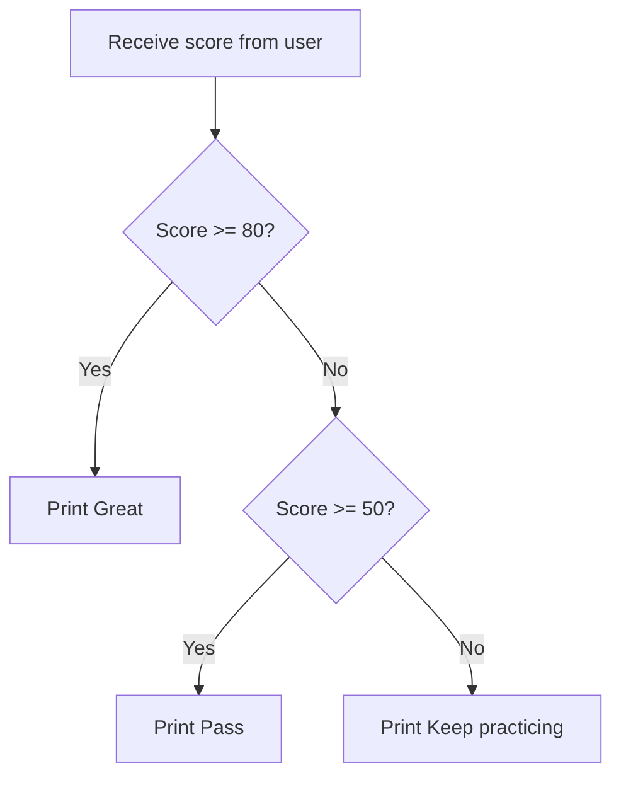

# Conditions

Conditions let a program make decisions, such as pass/fail, login allowed/denied, or which menu option to run.

## if, elif, else

```python
score = int(input("Score: "))

if score >= 80:
    print("Great")
elif score >= 50:
    print("Pass")
else:
    print("Keep practicing")
```

Python uses indentation to decide which lines belong inside the condition.

## Decision flow



This diagram shows that Python checks conditions from top to bottom. Once a condition is true, Python follows that path.

## Comparison operators

| Operator | Meaning |
| --- | --- |
| `==` | equal to |
| `!=` | not equal to |
| `>` | greater than |
| `<` | less than |
| `>=` | greater than or equal to |
| `<=` | less than or equal to |

## and, or, not

```python
age = 18
has_card = True

if age >= 18 and has_card:
    print("Allowed")
```

```python
is_admin = False
is_owner = True

if is_admin or is_owner:
    print("Can edit")
```

## Boolean expressions

A condition should read like a clear sentence. For example, `age >= 18` means age is at least 18.

## Common mistakes

- Using `=` instead of `==`.
- Forgetting `:` after `if`.
- Incorrect indentation.
- Checking broad conditions before specific ones.

## Practice

1. Ask for `age` and print `Child` if it is under 13, `Teen` if it is under 20, and `Adult` otherwise.
2. Ask for `score` and print grade A/B/C/D/F using score ranges 80, 70, 60, 50, and below 50.
3. Ask for `username` and `password`; allow login only when username is `admin` and password is `1234`.

<details class="answer-reveal">
<summary>Show practice answer</summary>

### Answer 1

Check age from the smallest range upward so child, teen, and adult are all covered.

```python
age = int(input("Age: "))
if age < 13:
    print("Child")
elif age < 20:
    print("Teen")
else:
    print("Adult")
```

### Answer 2

Check grades from highest to lowest so high scores are not caught by a broader condition first.

```python
score = int(input("Score: "))
if score >= 80:
    print("A")
elif score >= 70:
    print("B")
elif score >= 60:
    print("C")
elif score >= 50:
    print("D")
else:
    print("F")
```

### Answer 3

Both username and password must be correct, so use `and`.

```python
username = input("Username: ")
password = input("Password: ")
if username == "admin" and password == "1234":
    print("Login successful")
else:
    print("Wrong username or password")
```

</details>

## Mini challenge

Create a program that asks for a numeric temperature and suggests clothing for three cases: below 18 is cold, 18 to below 28 is cool, and 28 or higher is hot.

<details class="answer-reveal">
<summary>Show mini challenge answer</summary>

This example covers three temperature cases: cold, cool, and hot.

```python
temperature = float(input("Temperature today: "))

if temperature < 18:
    print("Cold: wear a jacket")
elif temperature < 28:
    print("Cool: wear a light long-sleeve shirt")
else:
    print("Hot: wear a comfy T-shirt and bring water")
```

</details>

## Summary

Conditions let your program choose different paths based on real data.
