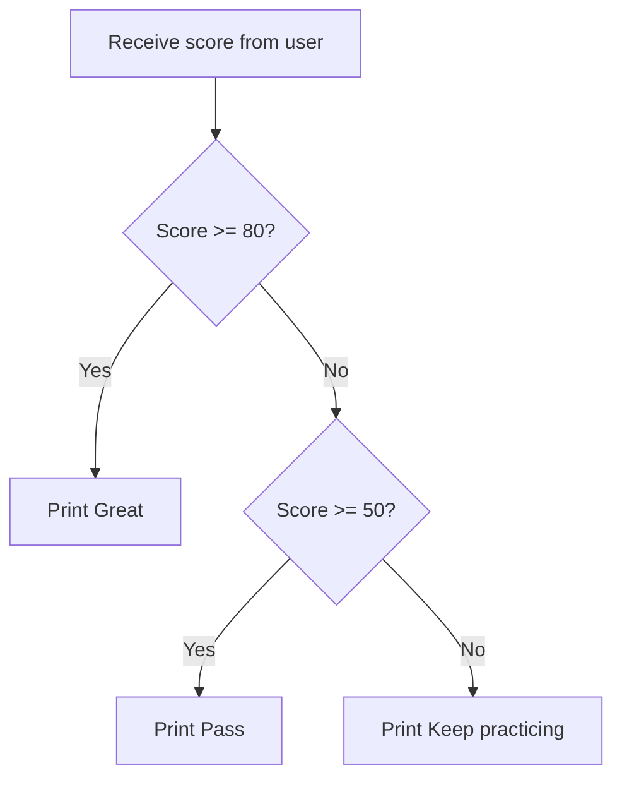

# Conditions

Conditions let a program make decisions, such as pass/fail, login allowed/denied, or which menu option to run.

## if, elif, else

```python
score = int(input("Score: "))

if score >= 80:
    print("Great")
elif score >= 50:
    print("Pass")
else:
    print("Keep practicing")
```

Python uses indentation to decide which lines belong inside the condition.

Always order an `elif` chain from one end of the range to the other, because Python stops at the first branch that is true. That is why you never need to write `elif score >= 50 and score < 80`. You can plan a chain like this before writing code by using [pseudocode](./pseudocode.md).

## Decision flow



This diagram shows that Python checks conditions from top to bottom. Once a condition is true, Python follows that path.

## Comparison operators

| Operator | Meaning |
| --- | --- |
| `==` | equal to |
| `!=` | not equal to |
| `>` | greater than |
| `<` | less than |
| `>=` | greater than or equal to |
| `<=` | less than or equal to |

## Comparing text

`==` works on text too, but it treats uppercase and lowercase as different characters.

```python
print("python" == "Python")
print("python" == "python")
```

Output:

```text
False
True
```

A comparison produces a `bool`, so you can `print()` it directly without putting it inside an `if`.

To compare without caring about capitalisation or surrounding spaces, clean the text first with `.strip()` and `.lower()`.

```python
print("Python ".strip().lower() == "python")
```

Output:

```text
True
```

## and, or, not

```python
age = 18
has_card = True

if age >= 18 and has_card:
    print("Allowed")
```

```python
is_admin = False
is_owner = True

if is_admin or is_owner:
    print("Can edit")
```

`not` flips true into false and false into true.

```python
is_logged_in = False

if not is_logged_in:
    print("Please log in first")
```

In short: `and` is true when both sides are true, `or` is true when at least one side is true, and `not` reverses the value.

A login check needs both the username and the password to be correct, so it uses `and`.

```python
username = input("username: ")
password = input("password: ")

if username == "admin" and password == "1234":
    print("Login successful")
else:
    print("Incorrect username or password")
```

## Boolean expressions

A condition should read like a clear sentence. For example, `age >= 18` means age is at least 18.

## Common mistakes

- Using `=` instead of `==`.
- Forgetting `:` after `if`.
- Incorrect indentation.
- Checking broad conditions before specific ones.

## Practice

1. Ask for `age` and print `Child` if it is under 13, `Teen` if it is under 20, and `Adult` otherwise.
2. Ask for `score` and print grade A/B/C/D/F using score ranges 80, 70, 60, 50, and below 50.
3. Ask for two words, print `True` or `False` for whether they match exactly including capitalisation, then print a confirmation message only when they match and neither word is empty.

<details class="answer-reveal">
<summary>Show practice answer</summary>

### Answer 1

Check age from the smallest range upward so child, teen, and adult are all covered.

```python
age = int(input("Age: "))
if age < 13:
    print("Child")
elif age < 20:
    print("Teen")
else:
    print("Adult")
```

### Answer 2

Check grades from highest to lowest so high scores are not caught by a broader condition first.

```python
score = int(input("Score: "))
if score >= 80:
    print("A")
elif score >= 70:
    print("B")
elif score >= 60:
    print("C")
elif score >= 50:
    print("D")
else:
    print("F")
```

### Answer 3

`==` already compares text case-sensitively, so you can `print()` the result directly, then use `and` to check that they match and neither is empty.

```python
word1 = input("Word 1: ")
word2 = input("Word 2: ")

is_same = word1 == word2
print(is_same)

if is_same and word1 != "":
    print("The two words match exactly")
```

</details>

## Mini challenge

Create a shipping cost program that asks for a parcel weight in kilograms and prints **both the cost and the delivery time**: up to 1 kg is 30 baht arriving in 1-2 days, more than 1 up to 5 kg is 60 baht arriving in 2-3 days, and more than 5 kg is 120 baht arriving in 3-5 days.

<details class="answer-reveal">
<summary>Show mini challenge answer</summary>

Order the branches from the lightest weight upward, and have each branch produce two values: the cost and the delivery time.

```python
weight = float(input("Parcel weight (kg): "))

if weight <= 1:
    cost = 30
    days = "1-2 days"
elif weight <= 5:
    cost = 60
    days = "2-3 days"
else:
    cost = 120
    days = "3-5 days"

print(f"Shipping cost: {cost} baht")
print(f"Delivery time: {days}")
```

</details>

## Summary

Conditions let your program choose different paths based on real data.
