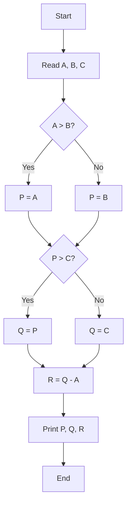
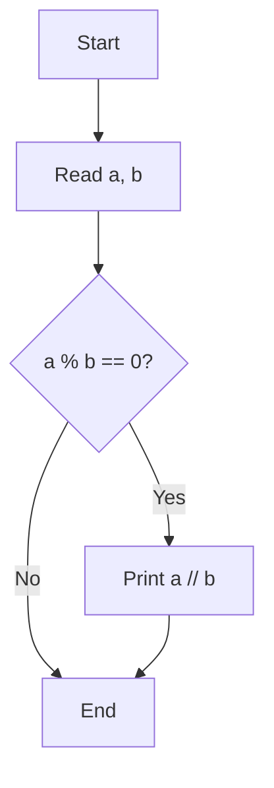
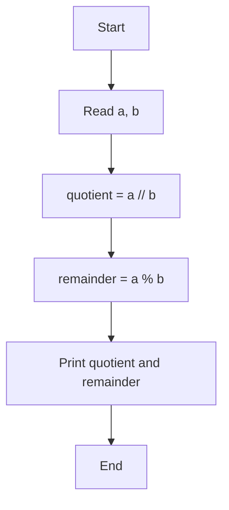
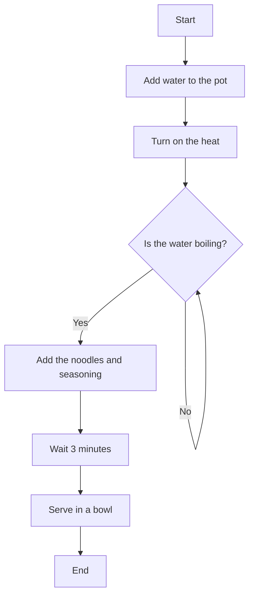
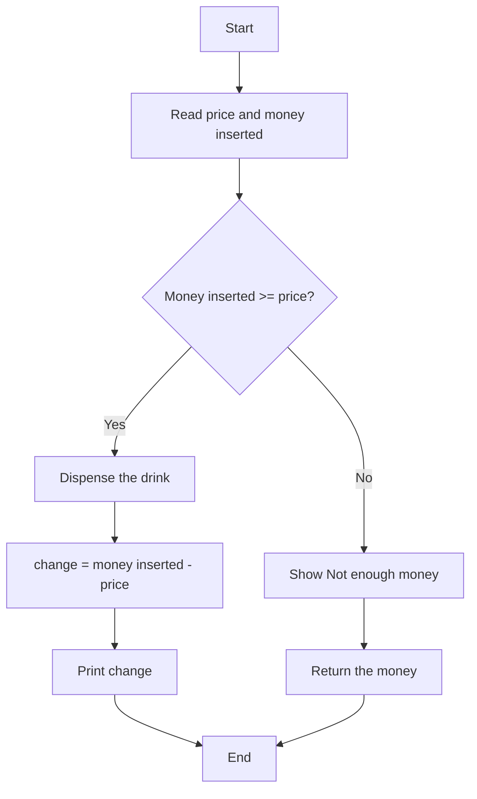

# Flowchart

A flowchart is a diagram of the steps a program takes, drawn before you write any code.

## What is a flowchart?

Before writing code, we should plan what the program needs to do and in what order. A clearly ordered set of steps is called an algorithm. A flowchart shows an algorithm with boxes and arrows, making the program's path easier to see. A complete flowchart should have one entry and one exit.

## Symbols you need to know

| Symbol | Name | What it does |
| --- | --- | --- |
| Oval | Start/end (terminator) | Marks where the work starts or ends |
| Parallelogram | Input/output | Reads input or displays output |
| Rectangle | Process | Calculates or assigns a value |
| Diamond | Decision | Tests a condition and branches |
| Arrow | Flow direction | Points to the next step |

The diagrams on this site draw terminator, input/output, and process boxes the same way; only a decision diamond has a different shape.

## Trace a flowchart step by step

Follow the arrows from the starting point and record each value as it changes.



| A | B | C | P | Q | R |
| --- | --- | --- | --- | --- | --- |
| 7 | 7 | 7 | 7 | 7 | 0 |
| 15 | 4 | 9 | 15 | 15 | 0 |
| 3 | -2 | 8 | 3 | 8 | 5 |

When two values are equal, `A > B?` is false, so the `No` branch runs—a common source of confusion.

## Draw a flowchart from a problem

The problem is to read two integers, divide the first by the second, and print the whole-number result only when it divides evenly.



Output:

```text
9 ÷ 3 → 3
8 ÷ 3 → shows nothing
```

A decision branch is allowed to do nothing at all; that is an `if` with no `else`.

## From flowchart to Python code

You do not need to install or run Python yet. As a preview, the Python code for the previous flowchart will look like this, and later lessons will explain it in detail.

```python
a = 9
b = 3

if a % b == 0:
    print(a // b)
```

| Flowchart part | In Python |
| --- | --- |
| Start/end box | The beginning and end of the program |
| Input box | `input()` |
| Process box | Calculation and assignment |
| Decision box | `if` |
| Backward arrow | `while` |
| Output box | `print()` |

In the [conditions](./conditions.md) and [loops](./loops.md) lessons, you will turn decision boxes and backward arrows into real code.

## Common mistakes

- Drawing an arrow with no destination
- Giving a decision box only one exit
- Leaving out the start or end point
- Putting the entire program in one box
- Drawing a backward arrow with no exit condition, causing an endless loop

## Practice

1. Trace the diagram in “Trace a flowchart step by step” again with (4, 9, 9), (20, 20, 6), and (-1, 5, 2), then write P, Q, and R for each set.
2. Draw a flowchart that reads two integers and prints both the quotient and remainder. For 17 ÷ 5, it should print “3 r 2”.
3. Put these eight steps for cooking instant noodles in the correct order: wait 3 minutes, finish, is the water boiling?, add water to the pot, serve in a bowl, start, add the noodles and seasoning, turn on the heat.

<details class="answer-reveal">
<summary>Show practice answer</summary>

### Answer 1

Following the conditions in order and subtracting A from Q gives these results.

```text
(4, 9, 9) → P=9, Q=9, R=5
(20, 20, 6) → P=20, Q=20, R=0
(-1, 5, 2) → P=5, Q=5, R=6
```

### Answer 2

Use floor division for the quotient and the remainder operation for the amount left over.



### Answer 3

If the water is not boiling yet, return to the same test before adding the noodles and seasoning.



</details>

## Mini challenge

Draw a flowchart for a drink vending machine that reads the drink price and the money inserted. If the money is enough, dispense the drink and compute the change; otherwise, show “Not enough money” and return the money.

<details class="answer-reveal">
<summary>Show mini challenge answer</summary>

Test the amount once, then bring both branches back to the same end point.



</details>

## Summary

A flowchart turns a problem into a visible sequence of steps. Once the path is correct, translating it into code becomes easier.
