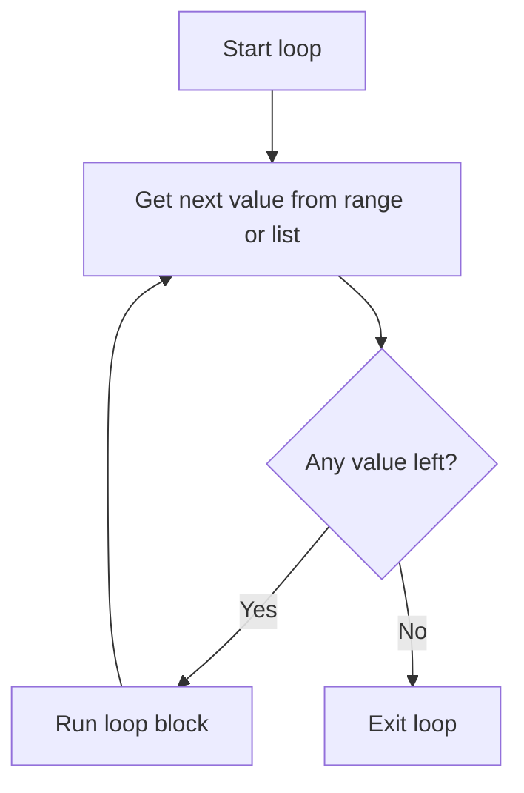
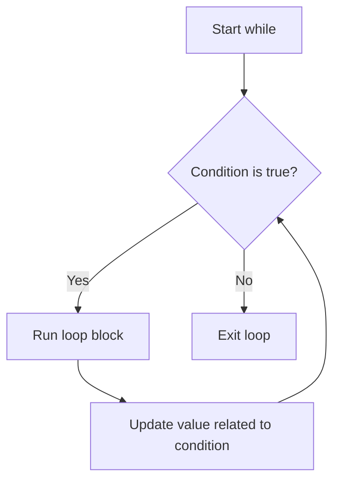

# Loops

Loops repeat work, such as printing numbers, checking items in a list, or asking for input until it is valid.

## for loop

Use a `for` loop when you know the number of repetitions or want to loop over a list.

```python
for number in range(1, 6):
    print(number)
```

Output:

```text
1
2
3
4
5
```

`range(1, 6)` gives 1 through 5. The end value is not included.

## for loop flow



This diagram shows how a `for` loop takes one value, runs the block, then repeats until no values are left.

## while loop

Use a `while` loop when you do not know how many repetitions are needed.

```python
password = ""

while password != "python":
    password = input("Password: ")

print("Login successful")
```

Example run:

```text
Password: 1234
Password: hello
Password: python
Login successful
```

The program keeps asking because `password != "python"` is still true until the user types `python`.



## break and continue

`break` stops the loop immediately.

```python
for number in range(1, 10):
    if number == 5:
        break
    print(number)
```

The output is `1` through `4` because the loop stops immediately when `number == 5`.

`continue` skips the current loop step.

```python
for number in range(1, 6):
    if number == 3:
        continue
    print(number)
```

The output is `1`, `2`, `4`, `5` because the step where `number == 3` is skipped.

## Loop through a list

```python
fruits = ["apple", "banana", "orange"]

for fruit in fruits:
    print(f"I like {fruit}")
```

Output:

```text
I like apple
I like banana
I like orange
```

## Common mistakes

- A `while` loop that never ends.
- Forgetting to update a counter.
- Expecting `range()` to include the final value.

## Practice

1. Print numbers 1 to 20.
2. Print even numbers from 2 to 50.
3. Ask for five numbers and calculate the total.

<details class="answer-reveal">
<summary>Show practice answer</summary>

### Answer 1

Use `range(1, 21)` because the ending number is not included.

```python
for number in range(1, 21):
    print(number)
```

### Answer 2

Use a step of `2` to skip from one even number to the next.

```python
for number in range(2, 51, 2):
    print(number)
```

### Answer 3

Start `total` at 0, then add each input value during the loop.

```python
total = 0
for round_number in range(1, 6):
    score = int(input(f"Number {round_number}: "))
    total += score

print(f"Total score: {total}")
```

</details>

## Mini challenge

Create a number guessing game where the user keeps guessing until correct.

<details class="answer-reveal">
<summary>Show mini challenge answer</summary>

Use `while True` to keep guessing, then `break` when the answer is correct.

```python
secret = 7
attempts = 0

while True:
    guess = int(input("Guess the secret number 1-10: "))
    attempts += 1

    if guess == secret:
        print(f"Correct! Attempts: {attempts}")
        break
    if guess < secret:
        print("Too low")
    else:
        print("Too high")
```

</details>

## Summary

Loops reduce repeated code and make larger programs possible.
