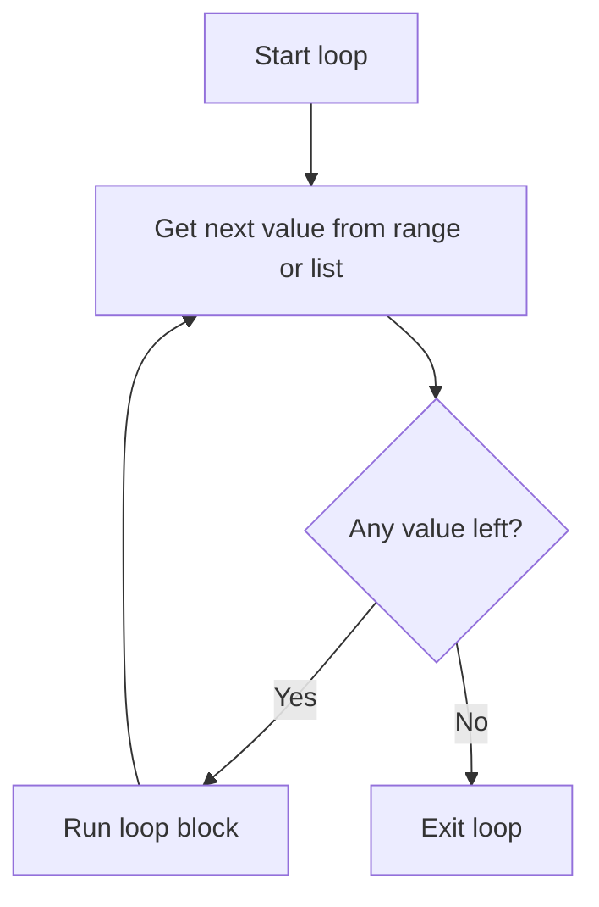
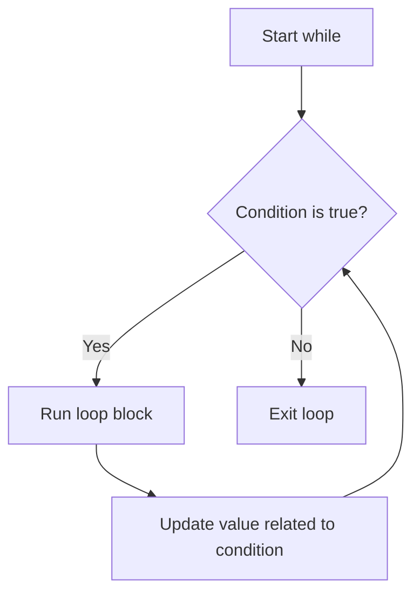

# Loops

Loops repeat work, such as printing numbers, checking items in a list, or asking for input until it is valid.

## for loop

Use a `for` loop when you know the number of repetitions or want to loop over a list.

```python
for number in range(1, 6):
    print(number)
```

`range(1, 6)` gives 1 through 5. The end value is not included.

## for loop flow



This diagram shows how a `for` loop takes one value, runs the block, then repeats until no values are left.

## while loop

Use a `while` loop when you do not know how many repetitions are needed.

```python
password = ""

while password != "python":
    password = input("Password: ")

print("Login successful")
```



## break and continue

`break` stops the loop immediately.

```python
for number in range(1, 10):
    if number == 5:
        break
    print(number)
```

`continue` skips the current loop step.

```python
for number in range(1, 6):
    if number == 3:
        continue
    print(number)
```

## Loop through a list

```python
fruits = ["apple", "banana", "orange"]

for fruit in fruits:
    print(f"I like {fruit}")
```

## Common mistakes

- A `while` loop that never ends.
- Forgetting to update a counter.
- Expecting `range()` to include the final value.

## Practice

1. Print numbers 1 to 20.
2. Print even numbers from 2 to 50.
3. Ask for five numbers and calculate the total.

## Mini challenge

Create a number guessing game where the user keeps guessing until correct.

## Summary

Loops reduce repeated code and make larger programs possible.
