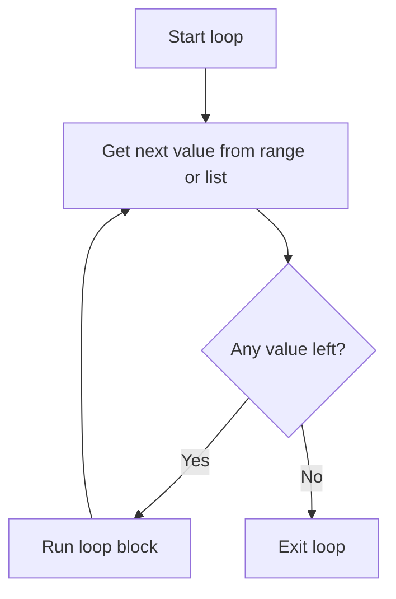
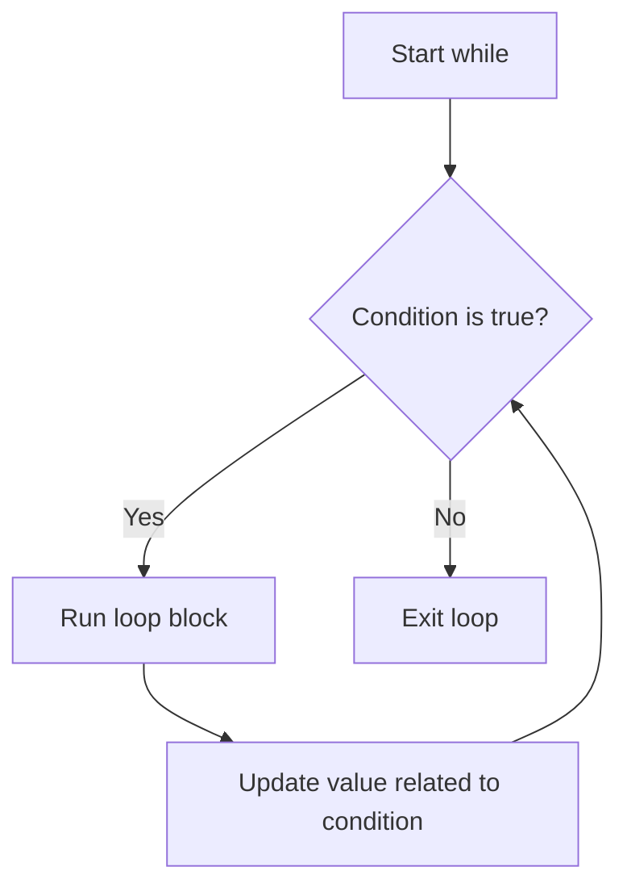

# Loops

Loops repeat work, such as printing numbers, checking items in a list, or asking for input until it is valid.

## for loop

Use a `for` loop when you know the number of repetitions or want to loop over a list.

```python
for number in range(1, 6):
    print(number)
```

Output:

```text
1
2
3
4
5
```

`range(1, 6)` gives 1 through 5. The end value is not included.

`range()` accepts a third number called the step, which is the gap between each round.

```python
for number in range(0, 21, 5):
    print(number)
```

Output:

```text
0
5
10
15
20
```

## for loop flow



This diagram shows how a `for` loop takes one value, runs the block, then repeats until no values are left.

## while loop

Use a `while` loop when you do not know how many repetitions are needed.

```python
password = ""

while password != "python":
    password = input("Password: ")

print("Login successful")
```

Example run:

```text
Password: 1234
Password: hello
Password: python
Login successful
```

The program keeps asking because `password != "python"` is still true until the user types `python`.

A value that signals the loop to stop like this is called a sentinel, and it can accumulate a total too. This example reads a step count for each day until the user types `0`.

```python
total = 0
days = 0

while True:
    steps = int(input("Steps today (0 to finish): "))
    if steps == 0:
        break
    total += steps
    days += 1

print(f"Total {total} steps across {days} days")
```

Example run:

```text
Steps today (0 to finish): 4500
Steps today (0 to finish): 6200
Steps today (0 to finish): 3800
Steps today (0 to finish): 0
Total 14500 steps across 3 days
```



## break and continue

`break` stops the loop immediately.

```python
for number in range(1, 10):
    if number == 5:
        break
    print(number)
```

The output is `1` through `4` because the loop stops immediately when `number == 5`.

`continue` skips the current loop step.

```python
for number in range(1, 6):
    if number == 3:
        continue
    print(number)
```

The output is `1`, `2`, `4`, `5` because the step where `number == 3` is skipped.

Both can appear in the same loop. This example skips odd numbers with `continue` and stops at 8 with `break`.

```python
for number in range(1, 11):
    if number % 2 != 0:
        continue
    if number == 8:
        break
    print(number)
```

Output:

```text
2
4
6
```

## Loop through a list

```python
fruits = ["apple", "banana", "orange"]

for fruit in fruits:
    print(f"I like {fruit}")
```

Output:

```text
I like apple
I like banana
I like orange
```

## Counting with a loop

Suppose satisfaction ratings from 1 to 5 are stored as text. You can count each rating with `.count()`.

```python
ratings = "3155131"

for score in range(1, 6):
    print(f"Rating {score}: {ratings.count(str(score))} people")
```

Output:

```text
Rating 1: 3 people
Rating 2: 0 people
Rating 3: 2 people
Rating 4: 0 people
Rating 5: 2 people
```

Notice that nobody chose 2 or 4, yet both still print `0`. That happens because the loop runs over the **range of possible ratings**, not over the data. If you looped over the data instead, the ratings nobody picked would disappear from the report.

## enumerate

When you need the position and the value at the same time, use `enumerate()`.

```python
speeds = [88, 132, 119, 141, 95]

for index, speed in enumerate(speeds):
    if speed > 120:
        print(f"Car {index + 1} is over the limit")
```

Output:

```text
Car 2 is over the limit
Car 4 is over the limit
```

`enumerate()` starts counting at 0, so use `index + 1` when readers should see positions 1, 2, 3. You can also write `enumerate(speeds, start=1)` to begin at 1 from the start.

## Common mistakes

- A `while` loop that never ends.
- Forgetting to update a counter.
- Expecting `range()` to include the final value.
- Using `for _ in range(5)` together with `continue` when the skipped round was not meant to use up a slot. It quietly does. To really collect 5 items, use `while len(chosen) < 5` instead.
- Forgetting that `enumerate()` starts counting at 0, not 1.

## Practice

1. Use `for` and `range()` with a step to print the multiples of 5 from 5 through 100, including 100.
2. Use a sentinel `while` loop to read item prices until the user types `0`, then print the total and how many prices were entered.
3. Given `temps = [31, 28, 35, 33, 27, 36]`, use `enumerate()` to print the day number (starting at 1) for every day hotter than 32.

<details class="answer-reveal">
<summary>Show practice answer</summary>

### Answer 1

Use a step of `5`, and write `101` because the ending number is not included.

```python
for number in range(5, 101, 5):
    print(number)
```

### Answer 2

You do not know in advance how many prices the user will enter, so use `while` and leave the loop when the sentinel value `0` arrives.

```python
total = 0
count = 0

while True:
    price = float(input("Item price (0 to finish): "))
    if price == 0:
        break
    total += price
    count += 1

print(f"Total {total:.2f} across {count} items")
```

### Answer 3

`enumerate()` gives both the position and the value, so use `index + 1` to make the days start at 1.

```python
temps = [31, 28, 35, 33, 27, 36]

for index, temp in enumerate(temps):
    if temp > 32:
        print(f"Day {index + 1}: {temp} degrees")
```

</details>

## Mini challenge

Create a program that picks 5 elective subjects. If the user types a subject that is already chosen, warn them and `continue` **without using up a slot**. If they type `done`, `break` immediately. Finally, print the list of chosen subjects.

<details class="answer-reveal">
<summary>Show mini challenge answer</summary>

This needs `while len(chosen) < 5` rather than `for _ in range(5)`, because a round that hits `continue` must not consume one of the five slots.

```python
chosen = []

while len(chosen) < 5:
    subject = input(f"Subject {len(chosen) + 1} (type done to stop): ")

    if subject == "done":
        print("Stopped picking subjects")
        break

    if subject in chosen:
        print("That subject is already chosen")
        continue

    chosen.append(subject)

print(f"Chosen subjects: {chosen}")
```

</details>

## Summary

Loops reduce repeated code and make larger programs possible.
