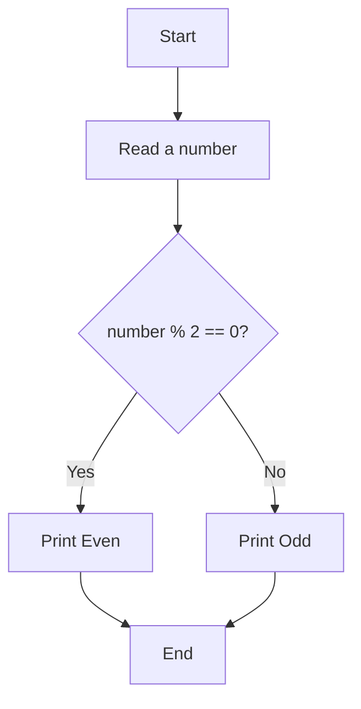
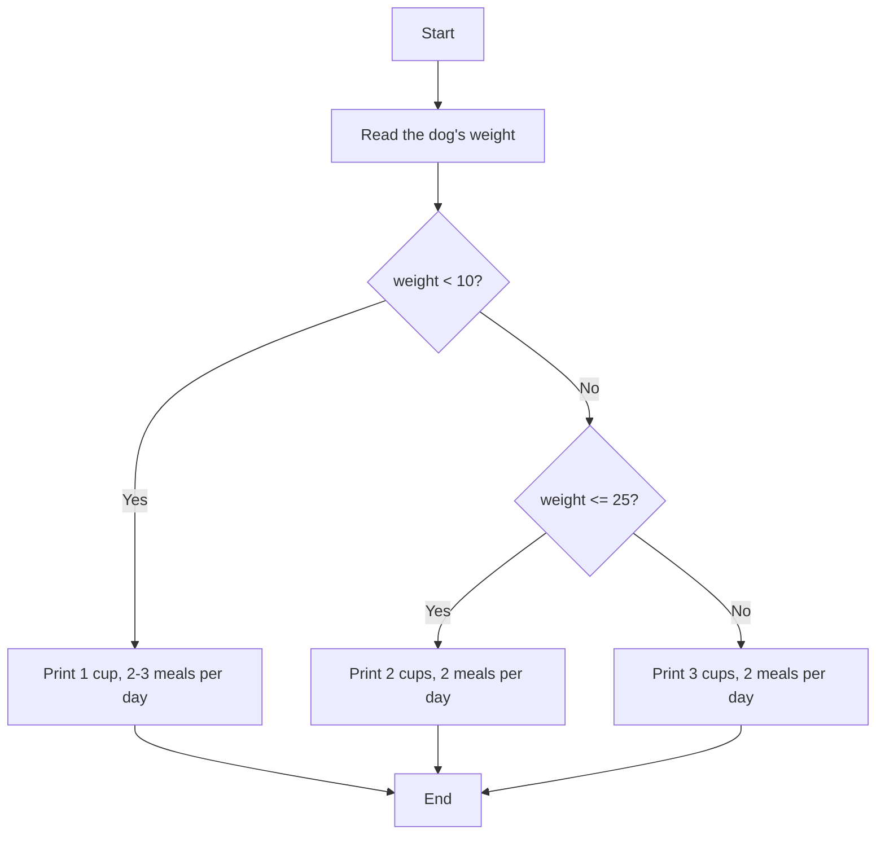
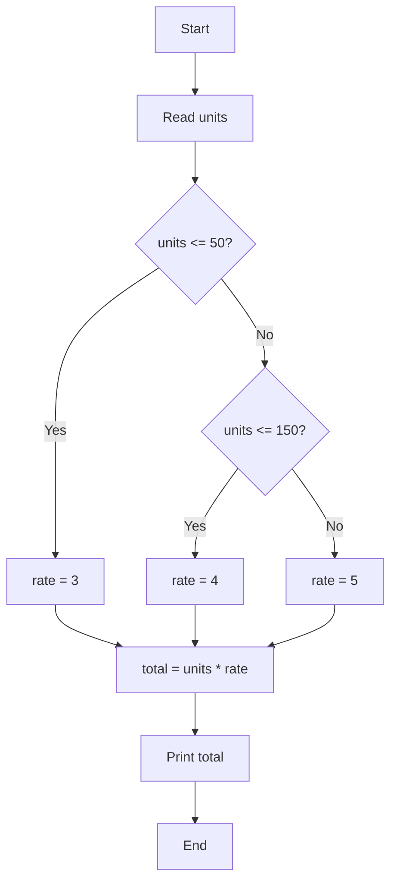

# Pseudocode

Pseudocode is a plain-language outline of a program's steps, written before you translate it into real code.

## What is pseudocode?

Pseudocode describes steps with text, while a [flowchart](./flowchart.md) shows the same steps with boxes and arrows. Both are ways to plan before writing real code. Pseudocode has no fixed syntax like a programming language, so choosing readable words and staying consistent matter more than using exact keywords.

## Basic keywords

| Keyword | Meaning |
| --- | --- |
| `START` / `END` | Begin / finish the work |
| `READ` | Receive input |
| `PRINT` | Display output |
| `SET x = ...` | Assign a value to a variable |
| `IF ... THEN` | Test the first condition |
| `ELSE IF` | Test another condition when the previous one is false |
| `ELSE` | Run when no condition is true |
| `ENDIF` | End a group of conditions |
| `WHILE ... ENDWHILE` | Repeat steps while a condition is true |

Indentation shows which steps are inside an `IF`, as in this tiny example.

```text
IF it is raining THEN
    PRINT "Take an umbrella"
ENDIF
```

## From a flowchart to pseudocode

The following flowchart and pseudocode describe the same even-or-odd test.



```text
START
READ number
IF number % 2 == 0 THEN
    PRINT "Even"
ELSE
    PRINT "Odd"
ENDIF
END
```

## Example: choosing between ranges

The problem is to read a dog's weight in kilograms and print the right amount of food: under 10 kg gets 1 cup, 2-3 meals per day; 10-25 kg gets 2 cups, 2 meals per day; and over 25 kg gets 3 cups, 2 meals per day.

```text
START
READ weight
IF weight < 10 THEN
    PRINT "1 cup, 2-3 meals per day"
ELSE IF weight <= 25 THEN
    PRINT "2 cups, 2 meals per day"
ELSE
    PRINT "3 cups, 2 meals per day"
ENDIF
END
```



The second test runs only when the first one is false, so you never need to repeat `AND weight >= 10`.

## From pseudocode to Python

| Pseudocode | Python |
| --- | --- |
| `READ` | `input()` |
| `SET` | `=` |
| `IF` / `ELSE IF` / `ELSE` | `if` / `elif` / `else` |
| `ENDIF` | Return to the previous indentation level |
| `WHILE` | `while` |
| `PRINT` | `print()` |

You do not need to install or run Python yet. As a preview, the dog-food example will look like this in Python, and later lessons will explain it in detail.

```python
weight = float(input("Dog's weight (kg): "))

if weight < 10:
    print("1 cup, 2-3 meals per day")
elif weight <= 25:
    print("2 cups, 2 meals per day")
else:
    print("3 cups, 2 meals per day")
```

The [basics](./basics.md), [input and output](./input-output.md), and [conditions](./conditions.md) lessons explain the parts of this example.

## Common mistakes

- Writing so much detail that pseudocode becomes real code, which removes its planning benefit
- Skipping the `ELSE` case so some input has no answer
- Making ranges overlap or leaving gaps, such as forgetting exactly 10
- Leaving out `ENDIF` or `ENDWHILE`, making it unclear where a condition or repetition ends
- Forgetting `START` or `END`

## Practice

1. Write pseudocode that reads three quiz scores, computes the average, and prints “Pass” if the average is 60 or more; otherwise, print “Fail”.
2. Write pseudocode that reads the UV index and recommends sun protection: 0-2 prints “No sunscreen needed”, 3-7 prints “Apply SPF 30”, and over 7 prints “Apply SPF 50 and use an umbrella”.
3. Write both pseudocode and a flowchart for an electricity bill: 0-50 units cost 3 baht per unit, 51-150 units cost 4 baht per unit, and over 150 units cost 5 baht per unit. Read the number of units and print the total. To keep this exercise simple, charge all usage at the single rate for its band.

<details class="answer-reveal">
<summary>Show practice answer</summary>

### Answer 1

Add the three scores and divide by 3 before testing whether the average reaches 60.

```text
START
READ score1, score2, score3
SET average = (score1 + score2 + score3) / 3
IF average >= 60 THEN
    PRINT "Pass"
ELSE
    PRINT "Fail"
ENDIF
END
```

### Answer 2

Test the UV ranges from low to high so each value follows exactly one path.

```text
START
READ uv
IF uv <= 2 THEN
    PRINT "No sunscreen needed"
ELSE IF uv <= 7 THEN
    PRINT "Apply SPF 30"
ELSE
    PRINT "Apply SPF 50 and use an umbrella"
ENDIF
END
```

### Answer 3

Choose the rate from the number of units first, then multiply every unit by that rate.

```text
START
READ units
IF units <= 50 THEN
    SET rate = 3
ELSE IF units <= 150 THEN
    SET rate = 4
ELSE
    SET rate = 5
ENDIF
SET total = units * rate
PRINT total
END
```



</details>

## Mini challenge

Write pseudocode to calculate a movie ticket price by reading the customer's age and whether they are a member: under 12 costs 80 baht, ages 12-59 cost 150 baht, and ages 60 or older cost 100 baht. Members get another 20 baht off. Print the final price.

<details class="answer-reveal">
<summary>Show mini challenge answer</summary>

Set the price from the age range first, then apply the member discount so the discount is not repeated in every range.

```text
START
READ age, is_member
IF age < 12 THEN
    SET price = 80
ELSE IF age < 60 THEN
    SET price = 150
ELSE
    SET price = 100
ENDIF
IF is_member == true THEN
    SET price = price - 20
ENDIF
PRINT price
END
```

```python
age = 25
is_member = True

if age < 12:
    price = 80
elif age < 60:
    price = 150
else:
    price = 100

if is_member:
    price = price - 20

print(price)
```

</details>

## Summary

Pseudocode lets you focus on reasoning and order without worrying about syntax. Once the plan is clear, you can translate each instruction into real code.
