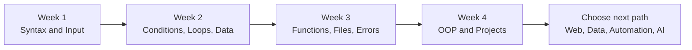

# Python101 Roadmap

This roadmap is designed for beginners and takes about four weeks. If you have less time, stretch it to six or eight weeks.

## Learning path overview

## Week 1: Start coding

- Install Python and an editor.
- Run `.py` files.
- Learn variables, strings, numbers, and booleans.
- Practice `print()` and `input()`.

Goal: write programs that accept input and show output.

## Week 2: Control program flow

- Conditions with `if/elif/else`.
- Loops with `for` and `while`.
- Lists and dictionaries.

Goal: build a number guessing game and a simple list manager.

## Week 3: Organize code

- Functions.
- Files.
- Error handling.
- Modules.

Goal: build a todo app that saves to a file and handles invalid input.

## Week 4: Build real projects

- Basic OOP.
- Complete two or three beginner projects.
- Practice reading documentation and searching errors.
- Learn virtual environments and `pip`.

Goal: finish at least two beginner portfolio projects.

## After Python101

Choose a direction:

- Web: Flask, FastAPI, Django
- Data: pandas, matplotlib, Jupyter
- Automation: pathlib, requests, scheduling
- AI: numpy, scikit-learn, basic PyTorch

## Checklist

- Explain variables and data types.
- Use conditions and loops.
- Use lists and dictionaries.
- Write functions.
- Read and write files.
- Handle basic errors.
- Build small projects independently.
