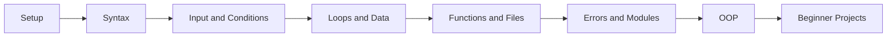

## คอร์สนี้เหมาะกับใคร

Python101 เหมาะกับผู้เรียนที่ยังไม่เคยเขียนโปรแกรม หรือเคยลองแล้วแต่ยังไม่เข้าใจภาพรวม คอร์สนี้เน้นการอธิบายแบบช้า ชัด และต่อเนื่องจากเรื่องเล็กไปหาโปรเจกต์จริง

You can also use this site if you already know a little Python but want a structured review with Thai and English explanations side by side.

## เริ่มตรงไหนดี

| ถ้าคุณต้องการ | ไปที่ |
| --- | --- |
| เรียนจากศูนย์เป็นภาษาไทย | [Python101 ภาษาไทย](/th/) |
| เรียนหรือทบทวนเป็นภาษาอังกฤษ | [Python101 English](/en/) |
| ดูภาพรวมเวลาเรียน 4 สัปดาห์ | [Roadmap ภาษาไทย](/th/roadmap) |
| ฝึกทำโปรเจกต์หลังเรียนพื้นฐาน | [Beginner Projects](/th/projects) |

## สิ่งที่จะสร้างได้หลังเรียน

- โปรแกรมรับข้อมูลจากผู้ใช้และแสดงผลอย่างเป็นระเบียบ
- เครื่องคิดเลข เกมทายเลข และ quiz app
- To-do list และ contact book แบบบันทึกไฟล์ได้
- โค้ดที่แยกเป็น function อ่านง่าย และจัดการ error พื้นฐานได้
- พื้นฐานสำหรับต่อยอดไป Web, Data, Automation หรือ AI

## วิธีใช้เว็บนี้ให้ได้ผล

1. เรียนบทภาษาไทยก่อนถ้าเป็นผู้เริ่มต้น
2. พิมพ์โค้ดเอง อย่าแค่คัดลอก
3. เปลี่ยนค่าตัวแปรแล้วสังเกตผลลัพธ์
4. ทำแบบฝึกหัดท้ายบทก่อนข้ามไปบทถัดไป
5. กลับมาอ่านบทภาษาอังกฤษเพื่อจำคำศัพท์ที่ใช้ในเอกสารและ error message

## Course structure

The course starts with setup and syntax, then moves through input/output, conditions, loops, data structures, functions, files, error handling, modules, OOP, projects, and a roadmap for what to learn next.

## Deployment

This site is built with VitePress and Bun. It includes deployment configuration for GitHub Pages and Vercel, with static output generated at `docs/.vitepress/dist`.
