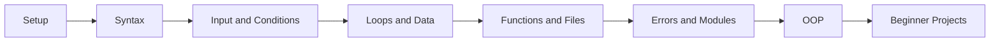

## คอร์สนี้เหมาะกับใคร

Python101 เหมาะกับคนที่อยากเริ่มเขียนโปรแกรมจริง ไม่ใช่อ่านแค่ทฤษฎีอย่างเดียว ถ้าคุณยังไม่เคยเขียนโค้ดมาก่อน หรือเคยลองแล้วแต่ยังไม่ต่อภาพรวมได้ คอร์สนี้จะพาเริ่มจากเรื่องง่ายไปหาโปรเจกต์จริงแบบช้า ชัด และตามทันได้

Python101 is for learners who want to code for real, not just read theory. If you have never written code before, or you have tried Python but still want the big picture, this course starts small and builds toward real projects step by step.

## เริ่มตรงไหนดี

| เป้าหมาย | ไปที่ |
| --- | --- |
| เริ่มจากศูนย์เป็นภาษาไทย | [Python101 ภาษาไทย](/th/) |
| เรียนหรือทบทวนเป็นภาษาอังกฤษ | [Python101 English](/en/) |
| ดูภาพรวมเวลาเรียน 4 สัปดาห์ | [Roadmap ภาษาไทย](/th/roadmap) |
| ฝึกทำโปรเจกต์หลังเรียนพื้นฐาน | [Beginner Projects](/th/projects) |

## หลังเรียนแล้วคุณจะทำอะไรได้

- เขียนโปรแกรมรับ input และแสดงผลได้เป็นระเบียบ
- สร้าง calculator, number guessing game, และ quiz app
- ทำ to-do list และ contact book แบบบันทึกไฟล์ได้
- แยกโค้ดเป็น function อ่านง่าย และ handle error พื้นฐานได้
- มีพื้นฐานพอสำหรับต่อยอดไป Web, Data, Automation หรือ AI

After the course, you will be able to:

- Write programs that take input and print clean output.
- Build a calculator, a number guessing game, and a quiz app.
- Create a file-based to-do list and contact book.
- Split code into readable functions and handle basic errors.
- Have enough foundation to move into Web, Data, Automation, or AI.

## วิธีใช้เว็บนี้ให้ได้ผล

1. เรียนบทภาษาไทยก่อนถ้าเป็นผู้เริ่มต้น
2. พิมพ์โค้ดเอง อย่าแค่คัดลอก
3. เปลี่ยนค่าตัวแปรแล้วสังเกตผลลัพธ์
4. ทำแบบฝึกหัดท้ายบทก่อนข้ามไปบทถัดไป
5. กลับมาอ่านบทภาษาอังกฤษเพื่อเก็บคำศัพท์และรูปแบบการอธิบาย

## Course map

The course starts with setup and syntax, then moves through input/output, conditions, loops, data structures, functions, files, error handling, modules, OOP, projects, and a roadmap for what to learn next.

## Deployment

This site is built with VitePress and Bun. It includes deployment configuration for GitHub Pages and Vercel, with static output generated at `docs/.vitepress/dist`.
