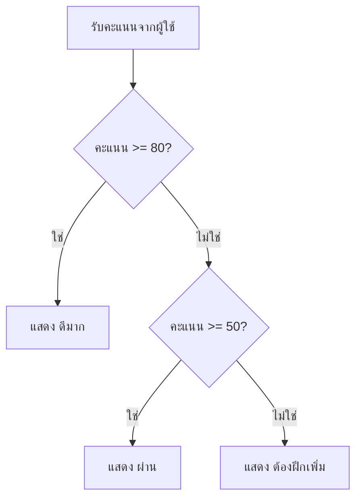

# เงื่อนไข

เงื่อนไขทำให้โปรแกรมตัดสินใจได้ เช่น ผ่าน/ไม่ผ่าน เข้าระบบได้/ไม่ได้ หรือเลือกเมนูตามคำสั่งผู้ใช้

## if, elif, else

```python
score = int(input("คะแนน: "))

if score >= 80:
    print("ดีมาก")
elif score >= 50:
    print("ผ่าน")
else:
    print("ต้องฝึกเพิ่ม")
```

Python ใช้ indentation เพื่อบอกว่าโค้ดบรรทัดไหนอยู่ในเงื่อนไข

## ภาพรวมการตัดสินใจ



แผนภาพนี้ช่วยให้เห็นว่า Python ตรวจเงื่อนไขจากบนลงล่าง เมื่อเจอเงื่อนไขที่เป็นจริงแล้วจะเลือกทางนั้นทันที

## ตัวดำเนินการเปรียบเทียบ

| เครื่องหมาย | ความหมาย |
| --- | --- |
| `==` | เท่ากับ |
| `!=` | ไม่เท่ากับ |
| `>` | มากกว่า |
| `<` | น้อยกว่า |
| `>=` | มากกว่าหรือเท่ากับ |
| `<=` | น้อยกว่าหรือเท่ากับ |

## and, or, not

```python
age = 18
has_card = True

if age >= 18 and has_card:
    print("เข้าได้")
```

```python
is_admin = False
is_owner = True

if is_admin or is_owner:
    print("แก้ไขได้")
```

## Boolean expression

เงื่อนไขควรอ่านออกเป็นประโยค เช่น `age >= 18` อ่านว่า อายุอย่างน้อย 18

## ข้อผิดพลาดที่พบบ่อย

- ใช้ `=` แทน `==`
- ลืม `:` หลัง `if`
- indentation ไม่ตรงกัน
- เรียงเงื่อนไขผิด เช่นตรวจ `score >= 50` ก่อน `score >= 80`

## แบบฝึกหัด

1. รับ `age` แล้วแสดง `เด็ก` ถ้าน้อยกว่า 13, `วัยรุ่น` ถ้าน้อยกว่า 20, และ `ผู้ใหญ่` สำหรับกรณีที่เหลือ
2. รับ `score` แล้วแสดงเกรด A/B/C/D/F โดยใช้ช่วงคะแนน 80, 70, 60, 50 และต่ำกว่า 50
3. รับ `username` และ `password`; ให้เข้าสู่ระบบได้เฉพาะเมื่อ username เป็น `admin` และ password เป็น `1234`

<details class="answer-reveal">
<summary>ดูเฉลยแบบฝึกหัด</summary>

### เฉลยข้อ 1

เรียงเงื่อนไขจากช่วงอายุน้อยไปมาก เพื่อให้เด็ก วัยรุ่น และผู้ใหญ่ถูกแยกครบทุกกรณี

```python
age = int(input("อายุ: "))
if age < 13:
    print("เด็ก")
elif age < 20:
    print("วัยรุ่น")
else:
    print("ผู้ใหญ่")
```

### เฉลยข้อ 2

เช็กเกรดจากคะแนนสูงลงมาต่ำ เพื่อไม่ให้คะแนนสูงถูกจับในเงื่อนไขกว้างเกินไปก่อน

```python
score = int(input("คะแนน: "))
if score >= 80:
    print("A")
elif score >= 70:
    print("B")
elif score >= 60:
    print("C")
elif score >= 50:
    print("D")
else:
    print("F")
```

### เฉลยข้อ 3

ต้องให้ทั้ง username และ password ถูกต้องพร้อมกัน จึงใช้ `and`

```python
username = input("username: ")
password = input("password: ")
if username == "admin" and password == "1234":
    print("เข้าสู่ระบบได้")
else:
    print("username หรือ password ไม่ถูกต้อง")
```

</details>

## Mini challenge

สร้างโปรแกรมที่รับอุณหภูมิเป็นตัวเลข แล้วแนะนำเสื้อผ้า 3 กรณี: ต่ำกว่า 18 คือหนาว, 18 ถึงต่ำกว่า 28 คือเย็น, และ 28 ขึ้นไปคือร้อน

<details class="answer-reveal">
<summary>ดูเฉลย Mini challenge</summary>

ตัวอย่างนี้ครอบคลุม 3 ช่วงอุณหภูมิ: หนาว เย็น และร้อน

```python
temperature = float(input("อุณหภูมิวันนี้: "))

if temperature < 18:
    print("หนาว: ใส่เสื้อกันหนาว")
elif temperature < 28:
    print("เย็น: ใส่เสื้อแขนยาวบาง ๆ")
else:
    print("ร้อน: ใส่เสื้อยืดสบาย ๆ และพกน้ำ")
```

</details>

## สรุป

เงื่อนไขช่วยให้โปรแกรมเลือกทางเดินตามข้อมูลจริง เป็นพื้นฐานสำคัญของโปรแกรมทุกแบบ
