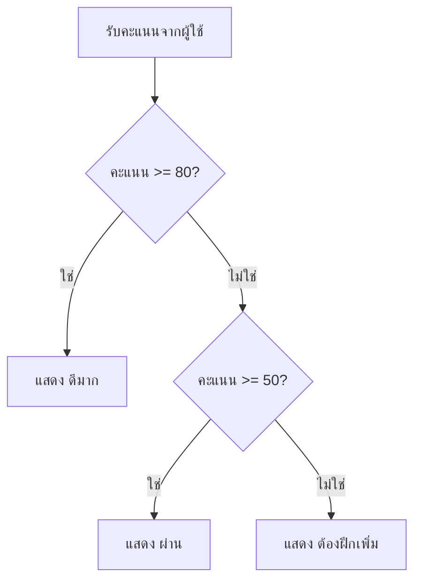

# เงื่อนไข

เงื่อนไขทำให้โปรแกรมตัดสินใจได้ เช่น ผ่าน/ไม่ผ่าน เข้าระบบได้/ไม่ได้ หรือเลือกเมนูตามคำสั่งผู้ใช้

## if, elif, else

```python
score = int(input("คะแนน: "))

if score >= 80:
    print("ดีมาก")
elif score >= 50:
    print("ผ่าน")
else:
    print("ต้องฝึกเพิ่ม")
```

Python ใช้ indentation เพื่อบอกว่าโค้ดบรรทัดไหนอยู่ในเงื่อนไข

เรียงเงื่อนไขใน `elif` ไล่จากปลายด้านหนึ่งของช่วงไปอีกด้านหนึ่งเสมอ เพราะ Python จะหยุดที่เงื่อนไขแรกที่เป็นจริง จึงไม่ต้องเขียน `elif score >= 50 and score < 80` ให้ยาวโดยไม่จำเป็น การวางแผนเงื่อนไขก่อนเขียนโค้ดทำได้ด้วย [รหัสเทียม](./pseudocode.md)

## ภาพรวมการตัดสินใจ



แผนภาพนี้ช่วยให้เห็นว่า Python ตรวจเงื่อนไขจากบนลงล่าง เมื่อเจอเงื่อนไขที่เป็นจริงแล้วจะเลือกทางนั้นทันที

## ตัวดำเนินการเปรียบเทียบ

| เครื่องหมาย | ความหมาย |
| --- | --- |
| `==` | เท่ากับ |
| `!=` | ไม่เท่ากับ |
| `>` | มากกว่า |
| `<` | น้อยกว่า |
| `>=` | มากกว่าหรือเท่ากับ |
| `<=` | น้อยกว่าหรือเท่ากับ |

## เปรียบเทียบข้อความ

`==` ใช้กับข้อความได้ แต่จะแยกตัวพิมพ์เล็กกับตัวพิมพ์ใหญ่เป็นคนละตัว

```python
print("python" == "Python")
print("python" == "python")
```

ผลลัพธ์:

```text
False
True
```

ผลของการเปรียบเทียบเป็นค่า `bool` จึงนำไป `print()` ตรง ๆ ได้โดยไม่ต้องใส่ใน `if`

ถ้าอยากเทียบแบบไม่สนตัวพิมพ์และไม่สนช่องว่างหน้าหลัง ให้ปรับข้อความก่อนด้วย `.strip()` และ `.lower()`

```python
print("Python ".strip().lower() == "python")
```

ผลลัพธ์:

```text
True
```

## and, or, not

```python
age = 18
has_card = True

if age >= 18 and has_card:
    print("เข้าได้")
```

```python
is_admin = False
is_owner = True

if is_admin or is_owner:
    print("แก้ไขได้")
```

`not` ใช้กลับค่าจริงเป็นเท็จและเท็จเป็นจริง

```python
is_logged_in = False

if not is_logged_in:
    print("กรุณาเข้าสู่ระบบก่อน")
```

สรุปสั้น ๆ: `and` เป็นจริงเมื่อทั้งสองฝั่งเป็นจริง, `or` เป็นจริงเมื่อมีอย่างน้อยหนึ่งฝั่งเป็นจริง, `not` กลับค่าเดิมเป็นตรงข้าม

ตัวอย่างการเข้าสู่ระบบที่ต้องถูกทั้ง username และ password จึงใช้ `and`

```python
username = input("username: ")
password = input("password: ")

if username == "admin" and password == "1234":
    print("เข้าสู่ระบบได้")
else:
    print("username หรือ password ไม่ถูกต้อง")
```

## Boolean expression

เงื่อนไขควรอ่านออกเป็นประโยค เช่น `age >= 18` อ่านว่า อายุอย่างน้อย 18

## ข้อผิดพลาดที่พบบ่อย

- ใช้ `=` แทน `==`
- ลืม `:` หลัง `if`
- indentation ไม่ตรงกัน
- เรียงเงื่อนไขผิด เช่นตรวจ `score >= 50` ก่อน `score >= 80`

## แบบฝึกหัด

1. รับ `age` แล้วแสดง `เด็ก` ถ้าน้อยกว่า 13, `วัยรุ่น` ถ้าน้อยกว่า 20, และ `ผู้ใหญ่` สำหรับกรณีที่เหลือ
2. รับ `score` แล้วแสดงเกรด A/B/C/D/F โดยใช้ช่วงคะแนน 80, 70, 60, 50 และต่ำกว่า 50
3. รับคำศัพท์ 2 คำจากผู้ใช้ แสดง `True` หรือ `False` ว่าทั้งสองคำเหมือนกันทุกประการหรือไม่ (คำนึงถึงตัวพิมพ์เล็ก-ใหญ่) จากนั้นแสดงข้อความยืนยันเฉพาะเมื่อทั้งสองคำตรงกัน และไม่มีคำใดเป็นค่าว่าง

<details class="answer-reveal">
<summary>ดูเฉลยแบบฝึกหัด</summary>

### เฉลยข้อ 1

เรียงเงื่อนไขจากช่วงอายุน้อยไปมาก เพื่อให้เด็ก วัยรุ่น และผู้ใหญ่ถูกแยกครบทุกกรณี

```python
age = int(input("อายุ: "))
if age < 13:
    print("เด็ก")
elif age < 20:
    print("วัยรุ่น")
else:
    print("ผู้ใหญ่")
```

### เฉลยข้อ 2

เช็กเกรดจากคะแนนสูงลงมาต่ำ เพื่อไม่ให้คะแนนสูงถูกจับในเงื่อนไขกว้างเกินไปก่อน

```python
score = int(input("คะแนน: "))
if score >= 80:
    print("A")
elif score >= 70:
    print("B")
elif score >= 60:
    print("C")
elif score >= 50:
    print("D")
else:
    print("F")
```

### เฉลยข้อ 3

`==` เปรียบเทียบข้อความแบบคำนึงตัวพิมพ์อยู่แล้ว จึง `print()` ผลได้ตรง ๆ แล้วค่อยใช้ `and` ตรวจว่าตรงกันและไม่ว่างทั้งคู่

```python
word1 = input("คำที่ 1: ")
word2 = input("คำที่ 2: ")

is_same = word1 == word2
print(is_same)

if is_same and word1 != "":
    print("คำทั้งสองเหมือนกันทุกประการ")
```

</details>

## Mini challenge

สร้างโปรแกรมคิดค่าส่งพัสดุที่รับน้ำหนักเป็นกิโลกรัม แล้วแสดง **ทั้งค่าส่งและระยะเวลาจัดส่ง**: ไม่เกิน 1 กก. คือ 30 บาท ส่งถึงใน 1-2 วัน, มากกว่า 1 ถึง 5 กก. คือ 60 บาท ส่งถึงใน 2-3 วัน, และมากกว่า 5 กก. คือ 120 บาท ส่งถึงใน 3-5 วัน

<details class="answer-reveal">
<summary>ดูเฉลย Mini challenge</summary>

เรียงเงื่อนไขจากน้ำหนักน้อยไปมาก และแต่ละแขนงแสดงผลสองค่าคือค่าส่งกับระยะเวลา

```python
weight = float(input("น้ำหนักพัสดุ (กก.): "))

if weight <= 1:
    cost = 30
    days = "1-2 วัน"
elif weight <= 5:
    cost = 60
    days = "2-3 วัน"
else:
    cost = 120
    days = "3-5 วัน"

print(f"ค่าส่ง: {cost} บาท")
print(f"ระยะเวลาจัดส่ง: {days}")
```

</details>

## สรุป

เงื่อนไขช่วยให้โปรแกรมเลือกทางเดินตามข้อมูลจริง เป็นพื้นฐานสำคัญของโปรแกรมทุกแบบ
