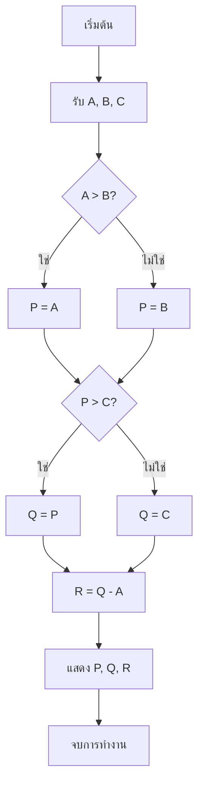
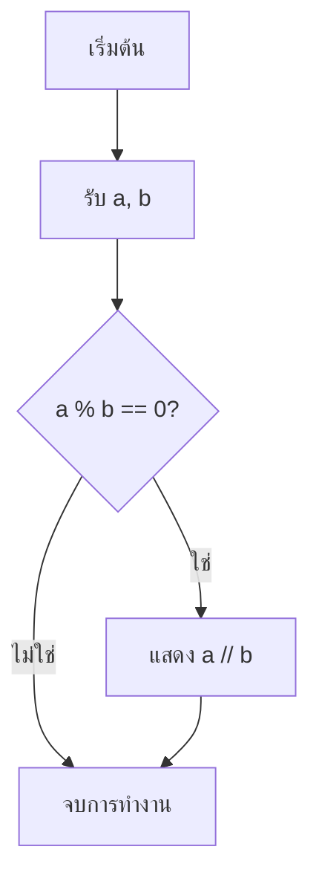
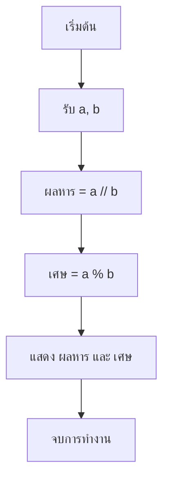
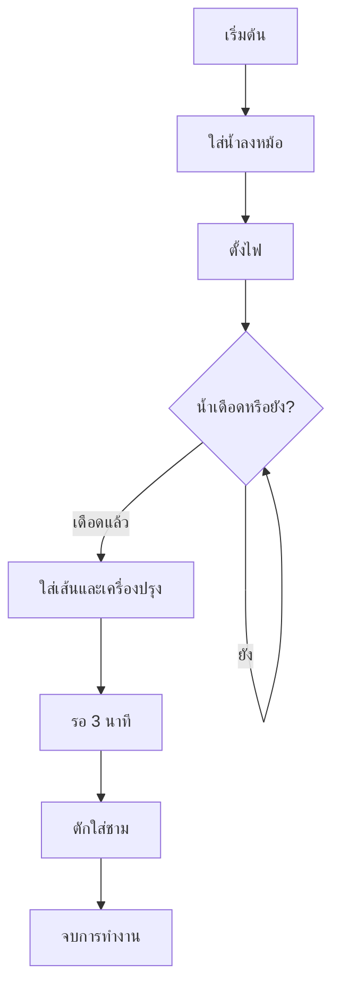
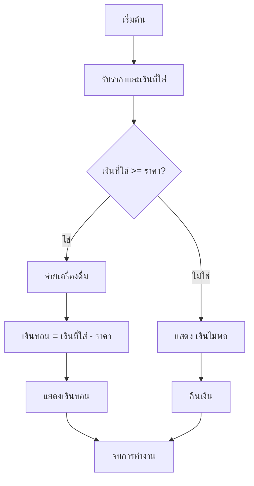

# ผังงาน (Flowchart)

ผังงานคือแผนภาพที่บอกลำดับการทำงานของโปรแกรมก่อนลงมือพิมพ์โค้ด

## ผังงานคืออะไร

ก่อนเขียนโค้ด เราควรวางแผนว่าโปรแกรมต้องทำอะไรและทำตามลำดับใด แผนที่เรียงขั้นตอนอย่างชัดเจนเรียกว่าอัลกอริทึม ผังงานนำอัลกอริทึมมาแสดงเป็นกล่องและลูกศร จึงช่วยให้เรามองเห็นทางเดินของโปรแกรมได้ง่าย ผังงานที่สมบูรณ์ควรมีทางเข้าเพียงหนึ่งจุดและทางออกเพียงหนึ่งจุด

## สัญลักษณ์ที่ต้องรู้

| สัญลักษณ์ | ชื่อ | ใช้ทำอะไร |
| --- | --- | --- |
| วงรี | เริ่ม/จบ (terminator) | บอกจุดเริ่มต้นหรือจุดจบ |
| สี่เหลี่ยมด้านขนาน | รับ/แสดงข้อมูล (input/output) | รับข้อมูลเข้าหรือแสดงผล |
| สี่เหลี่ยม | ประมวลผล (process) | คำนวณหรือกำหนดค่า |
| สี่เหลี่ยมข้าวหลามตัด | ตัดสินใจ (decision) | ตรวจเงื่อนไขแล้วแยกทาง |
| เส้นลูกศร | ทิศทางการทำงาน (flow direction) | บอกว่าขั้นตอนถัดไปอยู่ที่ใด |

แผนภาพในเว็บไซต์นี้วาดกล่องเริ่ม/จบ รับ/แสดงข้อมูล และประมวลผลด้วยรูปแบบเดียวกัน โดยมีเพียงกล่องตัดสินใจที่เป็นรูปข้าวหลามตัด

## อ่านผังงานทีละขั้น

ลองไล่ตามลูกศรจากจุดเริ่มต้น และจดค่าที่เปลี่ยนไปในแต่ละกล่อง



| A | B | C | P | Q | R |
| --- | --- | --- | --- | --- | --- |
| 7 | 7 | 7 | 7 | 7 | 0 |
| 15 | 4 | 9 | 15 | 15 | 0 |
| 3 | -2 | 8 | 3 | 8 | 5 |

เมื่อสองค่าเท่ากัน เงื่อนไข `A > B?` เป็นเท็จ จึงไปทาง `ไม่ใช่` ซึ่งเป็นจุดที่หลายคนมักสับสน

## เขียนผังงานจากโจทย์

โจทย์คือรับจำนวนเต็มสองจำนวน หารจำนวนแรกด้วยจำนวนที่สอง และแสดงผลลัพธ์จำนวนเต็มเฉพาะเมื่อหารลงตัว



ผลลัพธ์:

```text
9 ÷ 3 → 3
8 ÷ 3 → ไม่แสดงอะไรเลย
```

แขนงหนึ่งของการตัดสินใจไม่ต้องทำอะไรเลยก็ได้ ซึ่งก็คือ `if` ที่ไม่มี `else`

## จากผังงานเป็นโค้ด Python

ยังไม่ต้องติดตั้งหรือรัน Python ตอนนี้ โค้ด Python จากผังงานก่อนหน้าจะหน้าตาแบบนี้ ซึ่งเราจะเรียนรายละเอียดในบทถัดไป

```python
a = 9
b = 3

if a % b == 0:
    print(a // b)
```

| ส่วนของผังงาน | เมื่อนำไปเขียน Python |
| --- | --- |
| กล่องเริ่ม/จบ | จุดเริ่มและจบของโปรแกรม |
| กล่องรับข้อมูล | `input()` |
| กล่องประมวลผล | การคำนวณและกำหนดค่า |
| กล่องตัดสินใจ | `if` |
| ลูกศรย้อนกลับ | `while` |
| กล่องแสดงผล | `print()` |

เมื่อเรียนถึงบท [เงื่อนไข](./conditions.md) และ [ลูป](./loops.md) เราจะนำกล่องตัดสินใจและลูกศรย้อนกลับไปเขียนเป็นโค้ดจริง

## ข้อผิดพลาดที่พบบ่อย

- วาดลูกศรที่ไม่มีปลายทาง
- วาดกล่องตัดสินใจที่มีทางออกเพียงทางเดียว
- ไม่มีจุดเริ่มต้นหรือจุดจบ
- ยัดทั้งโปรแกรมไว้ในกล่องเดียว
- วาดลูกศรย้อนกลับโดยไม่มีเงื่อนไขให้ออก จึงวนไม่รู้จบ

## แบบฝึกหัด

1. ไล่ผังงานในหัวข้อ “อ่านผังงานทีละขั้น” อีกครั้งด้วยข้อมูล (4, 9, 9), (20, 20, 6) และ (-1, 5, 2) แล้วเขียนค่า P, Q, R ของแต่ละชุด
2. วาดผังงานที่รับจำนวนเต็มสองจำนวน แล้วแสดงทั้งผลหารและเศษ โดยข้อมูล 17 ÷ 5 ต้องแสดงเป็น “3 เศษ 2”
3. เรียง 8 ขั้นตอนการต้มบะหมี่กึ่งสำเร็จรูปให้ถูกต้อง: รอ 3 นาที, จบการทำงาน, น้ำเดือดหรือยัง?, ใส่น้ำลงหม้อ, ตักใส่ชาม, เริ่มต้น, ใส่เส้นและเครื่องปรุง, ตั้งไฟ

<details class="answer-reveal">
<summary>ดูเฉลยแบบฝึกหัด</summary>

### เฉลยข้อ 1

ไล่เงื่อนไขตามลำดับและใช้ค่า Q ลบ A จะได้ผลดังนี้

```text
(4, 9, 9) → P=9, Q=9, R=5
(20, 20, 6) → P=20, Q=20, R=0
(-1, 5, 2) → P=5, Q=5, R=6
```

### เฉลยข้อ 2

ใช้การหารปัดเศษลงหาผลหาร และใช้เศษจากการหารสำหรับค่าที่เหลือ



### เฉลยข้อ 3

ถ้าน้ำยังไม่เดือด ให้ย้อนกลับไปตรวจอีกครั้งก่อนใส่เส้นและเครื่องปรุง



</details>

## Mini challenge

วาดผังงานของตู้ขายเครื่องดื่มที่รับราคาเครื่องดื่มและจำนวนเงินที่ใส่ ถ้าเงินพอให้จ่ายเครื่องดื่มและคำนวณเงินทอน แต่ถ้าเงินไม่พอให้แสดง “เงินไม่พอ” และคืนเงิน

<details class="answer-reveal">
<summary>ดูเฉลย Mini challenge</summary>

ตรวจยอดเงินเพียงครั้งเดียว แล้วรวมทางทั้งสองกลับมาที่จุดจบเดียวกัน



</details>

## สรุป

ผังงานช่วยเปลี่ยนโจทย์ให้เป็นลำดับขั้นที่มองเห็นได้ชัดเจน เมื่อทางเดินถูกต้องแล้ว การแปลงเป็นโค้ดจะง่ายขึ้น
