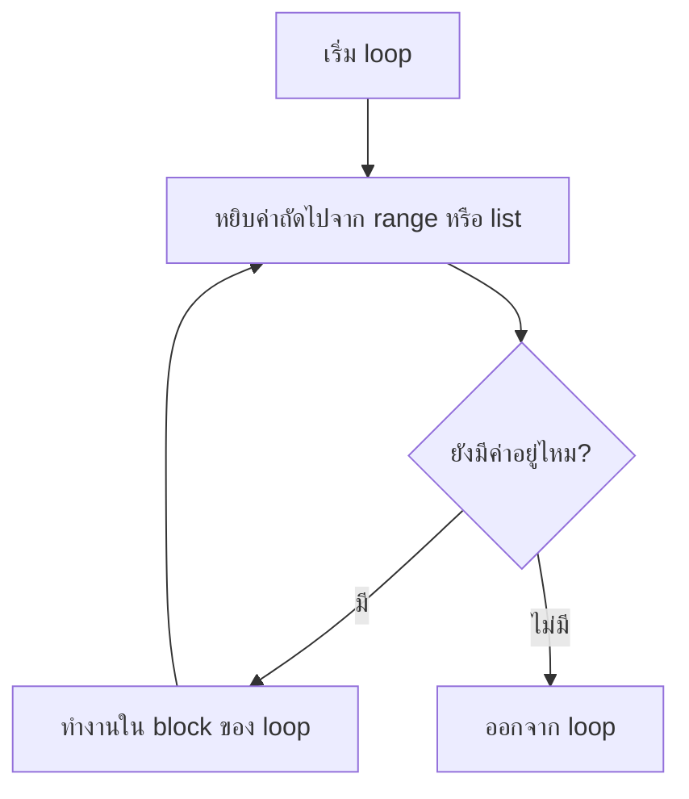
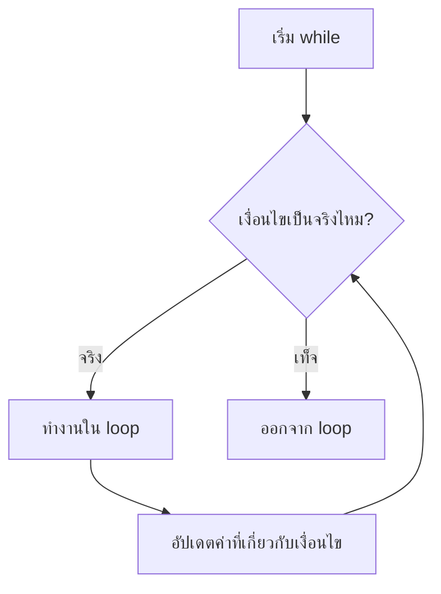

# Loops

Loop ใช้ทำงานซ้ำ เช่น แสดงตัวเลข 1-100 ตรวจรายการสินค้า หรือถามข้อมูลจนกว่าผู้ใช้จะพิมพ์ถูก

## for loop

ใช้เมื่อรู้จำนวนรอบหรือวนผ่านรายการ

```python
for number in range(1, 6):
    print(number)
```

ผลลัพธ์:

```text
1
2
3
4
5
```

`range(1, 6)` ได้เลข 1 ถึง 5 เพราะค่าสุดท้ายไม่รวม

`range()` ใส่ตัวเลขตัวที่สามได้ เรียกว่า step คือระยะห่างของแต่ละรอบ

```python
for number in range(0, 21, 5):
    print(number)
```

ผลลัพธ์:

```text
0
5
10
15
20
```

## ภาพรวม for loop



แผนภาพนี้อธิบายว่า `for` จะหยิบค่าทีละตัว ทำงานหนึ่งรอบ แล้วกลับไปหยิบค่าถัดไปจนหมด

## while loop

ใช้เมื่อยังไม่รู้จำนวนรอบ แต่มีเงื่อนไขให้ทำต่อ

```python
password = ""

while password != "python":
    password = input("รหัสผ่าน: ")

print("เข้าสู่ระบบสำเร็จ")
```

ตัวอย่างการรัน:

```text
รหัสผ่าน: 1234
รหัสผ่าน: hello
รหัสผ่าน: python
เข้าสู่ระบบสำเร็จ
```

โปรแกรมถามซ้ำเพราะ `password != "python"` ยังเป็นจริง จนกว่าผู้ใช้จะพิมพ์ `python`

ค่าที่ใช้เป็นสัญญาณให้หยุด loop แบบนี้เรียกว่า sentinel และใช้สะสมผลรวมได้ด้วย ตัวอย่างนี้รับจำนวนก้าวเดินของแต่ละวันไปเรื่อย ๆ จนกว่าผู้ใช้จะพิมพ์ `0`

```python
total = 0
days = 0

while True:
    steps = int(input("จำนวนก้าววันนี้ (0 เพื่อจบ): "))
    if steps == 0:
        break
    total += steps
    days += 1

print(f"รวม {total} ก้าว จาก {days} วัน")
```

ตัวอย่างการรัน:

```text
จำนวนก้าววันนี้ (0 เพื่อจบ): 4500
จำนวนก้าววันนี้ (0 เพื่อจบ): 6200
จำนวนก้าววันนี้ (0 เพื่อจบ): 3800
จำนวนก้าววันนี้ (0 เพื่อจบ): 0
รวม 14500 ก้าว จาก 3 วัน
```



## break และ continue

`break` หยุด loop ทันที

```python
for number in range(1, 10):
    if number == 5:
        break
    print(number)
```

ผลลัพธ์คือ `1` ถึง `4` เพราะ loop หยุดทันทีเมื่อ `number == 5`

`continue` ข้ามรอบปัจจุบัน

```python
for number in range(1, 6):
    if number == 3:
        continue
    print(number)
```

ผลลัพธ์คือ `1`, `2`, `4`, `5` เพราะรอบที่ `number == 3` ถูกข้าม

ใช้ทั้งสองคำสั่งใน loop เดียวกันได้ ตัวอย่างนี้ข้ามเลขคี่ด้วย `continue` และหยุดที่เลข 8 ด้วย `break`

```python
for number in range(1, 11):
    if number % 2 != 0:
        continue
    if number == 8:
        break
    print(number)
```

ผลลัพธ์:

```text
2
4
6
```

## Loop กับ list

```python
fruits = ["apple", "banana", "orange"]

for fruit in fruits:
    print(f"I like {fruit}")
```

ผลลัพธ์:

```text
I like apple
I like banana
I like orange
```

## นับจำนวนด้วย loop

สมมติเก็บคะแนนความพึงพอใจ 1-5 ไว้เป็นข้อความ เรานับจำนวนของแต่ละคะแนนได้ด้วย `.count()`

```python
ratings = "3155131"

for score in range(1, 6):
    print(f"คะแนน {score} มี {ratings.count(str(score))} คน")
```

ผลลัพธ์:

```text
คะแนน 1 มี 3 คน
คะแนน 2 มี 0 คน
คะแนน 3 มี 2 คน
คะแนน 4 มี 0 คน
คะแนน 5 มี 2 คน
```

สังเกตว่าคะแนน 2 และ 4 ไม่มีใครให้เลย แต่ยังแสดง `0` ออกมาครบ เพราะเราวน loop ตาม **ช่วงของคะแนนที่เป็นไปได้** ไม่ใช่วนตามข้อมูลที่มี ถ้าวนตามข้อมูลคะแนนที่ไม่มีใครเลือกจะหายไปเลย

## enumerate

เมื่อต้องการทั้งลำดับและค่าไปพร้อมกัน ให้ใช้ `enumerate()`

```python
speeds = [88, 132, 119, 141, 95]

for index, speed in enumerate(speeds):
    if speed > 120:
        print(f"คันที่ {index + 1} เร็วเกินกำหนด")
```

ผลลัพธ์:

```text
คันที่ 2 เร็วเกินกำหนด
คันที่ 4 เร็วเกินกำหนด
```

`enumerate()` เริ่มนับจาก 0 จึงต้องใช้ `index + 1` เมื่ออยากให้คนอ่านเห็นเป็นลำดับที่ 1, 2, 3 หรือจะสั่ง `enumerate(speeds, start=1)` ให้เริ่มนับที่ 1 ตั้งแต่แรกก็ได้

## ข้อผิดพลาดที่พบบ่อย

- `while` ไม่มีทางจบ กลายเป็น infinite loop
- ลืมเพิ่มค่าตัวนับ
- เข้าใจ `range()` ผิดว่ารวมเลขสุดท้าย
- ใช้ `for _ in range(5)` คู่กับ `continue` ทั้งที่ไม่อยากให้รอบที่ข้ามนับเป็นหนึ่งช่อง แต่มันนับให้เงียบ ๆ ถ้าต้องการให้ได้ครบ 5 รายการจริง ๆ ให้ใช้ `while len(chosen) < 5` แทน
- ลืมว่า `enumerate()` เริ่มนับที่ 0 ไม่ใช่ 1

## แบบฝึกหัด

1. ใช้ `for` และ `range()` ที่มี step แสดงเลขที่หารด้วย 5 ลงตัวตั้งแต่ 5 ถึง 100 โดยให้เลข 100 แสดงด้วย
2. ใช้ `while` แบบ sentinel รับราคาสินค้าจากผู้ใช้ไปเรื่อย ๆ จนกว่าจะพิมพ์ `0` แล้วแสดงราคารวมและจำนวนรายการที่รับมา
3. กำหนด `temps = [31, 28, 35, 33, 27, 36]` แล้วใช้ `enumerate()` แสดงลำดับวัน (เริ่มที่ 1) เฉพาะวันที่อุณหภูมิเกิน 32

<details class="answer-reveal">
<summary>ดูเฉลยแบบฝึกหัด</summary>

### เฉลยข้อ 1

ใช้ step เป็น `5` และต้องเขียน `101` เพราะเลขสุดท้ายไม่ถูกรวม

```python
for number in range(5, 101, 5):
    print(number)
```

### เฉลยข้อ 2

ยังไม่รู้ว่าผู้ใช้จะกรอกกี่รายการ จึงใช้ `while` แล้วออกจาก loop เมื่อเจอค่า sentinel คือ `0`

```python
total = 0
count = 0

while True:
    price = float(input("ราคาสินค้า (0 เพื่อจบ): "))
    if price == 0:
        break
    total += price
    count += 1

print(f"ราคารวม {total:.2f} บาท จาก {count} รายการ")
```

### เฉลยข้อ 3

`enumerate()` ให้ทั้งลำดับและค่า จึงใช้ `index + 1` เพื่อให้วันเริ่มนับที่ 1

```python
temps = [31, 28, 35, 33, 27, 36]

for index, temp in enumerate(temps):
    if temp > 32:
        print(f"วันที่ {index + 1} อุณหภูมิ {temp} องศา")
```

</details>

## Mini challenge

สร้างโปรแกรมเลือกวิชาเลือก 5 วิชา ถ้าผู้ใช้พิมพ์วิชาที่เลือกไปแล้วให้เตือนและ `continue` โดย **ไม่นับเป็นหนึ่งช่อง** ถ้าพิมพ์ `พอ` ให้ `break` ทันที สุดท้ายแสดงรายการวิชาที่เลือกได้

<details class="answer-reveal">
<summary>ดูเฉลย Mini challenge</summary>

ต้องใช้ `while len(chosen) < 5` ไม่ใช่ `for _ in range(5)` เพราะรอบที่ถูก `continue` ต้องไม่กินช่องของวิชาที่ยังเลือกได้

```python
chosen = []

while len(chosen) < 5:
    subject = input(f"วิชาที่ {len(chosen) + 1} (พิมพ์ พอ เพื่อหยุด): ")

    if subject == "พอ":
        print("หยุดเลือกวิชา")
        break

    if subject in chosen:
        print("เลือกวิชานี้ไปแล้ว")
        continue

    chosen.append(subject)

print(f"วิชาที่เลือกได้: {chosen}")
```

</details>

## สรุป

Loop ทำให้โปรแกรมทำงานซ้ำได้อย่างเป็นระบบ ลดการเขียนโค้ดซ้ำและเปิดทางสู่โปรเจกต์ที่ซับซ้อนขึ้น
