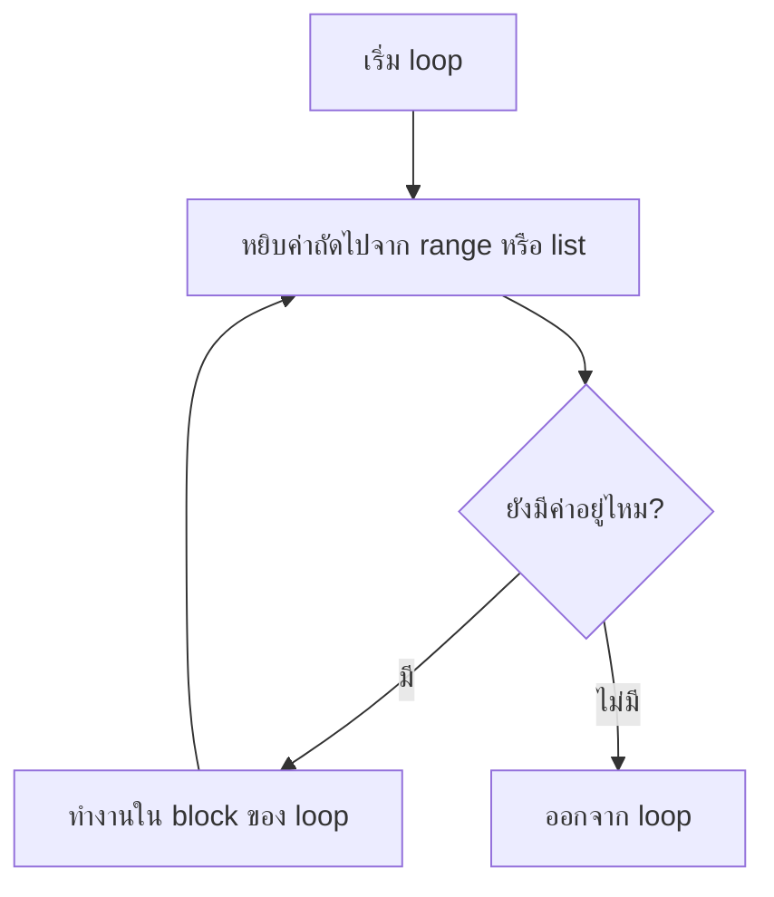
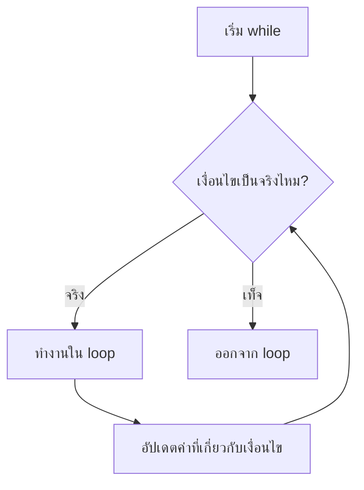

# Loops

Loop ใช้ทำงานซ้ำ เช่น แสดงตัวเลข 1-100 ตรวจรายการสินค้า หรือถามข้อมูลจนกว่าผู้ใช้จะพิมพ์ถูก

## for loop

ใช้เมื่อรู้จำนวนรอบหรือวนผ่านรายการ

```python
for number in range(1, 6):
    print(number)
```

`range(1, 6)` ได้เลข 1 ถึง 5 เพราะค่าสุดท้ายไม่รวม

## ภาพรวม for loop



แผนภาพนี้อธิบายว่า `for` จะหยิบค่าทีละตัว ทำงานหนึ่งรอบ แล้วกลับไปหยิบค่าถัดไปจนหมด

## while loop

ใช้เมื่อยังไม่รู้จำนวนรอบ แต่มีเงื่อนไขให้ทำต่อ

```python
password = ""

while password != "python":
    password = input("รหัสผ่าน: ")

print("เข้าสู่ระบบสำเร็จ")
```



## break และ continue

`break` หยุด loop ทันที

```python
for number in range(1, 10):
    if number == 5:
        break
    print(number)
```

`continue` ข้ามรอบปัจจุบัน

```python
for number in range(1, 6):
    if number == 3:
        continue
    print(number)
```

## Loop กับ list

```python
fruits = ["apple", "banana", "orange"]

for fruit in fruits:
    print(f"I like {fruit}")
```

## ข้อผิดพลาดที่พบบ่อย

- `while` ไม่มีทางจบ กลายเป็น infinite loop
- ลืมเพิ่มค่าตัวนับ
- เข้าใจ `range()` ผิดว่ารวมเลขสุดท้าย

## แบบฝึกหัด

1. แสดงเลข 1 ถึง 20
2. แสดงเฉพาะเลขคู่ 2 ถึง 50
3. รับตัวเลข 5 ตัว แล้วหาผลรวม

## Mini challenge

สร้างเกมทายเลข โดยให้ผู้ใช้ทายจนถูก แล้วบอกจำนวนครั้งที่ทาย

## สรุป

Loop ทำให้โปรแกรมทำงานซ้ำได้อย่างเป็นระบบ ลดการเขียนโค้ดซ้ำและเปิดทางสู่โปรเจกต์ที่ซับซ้อนขึ้น
