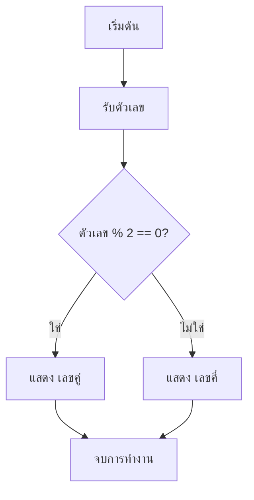
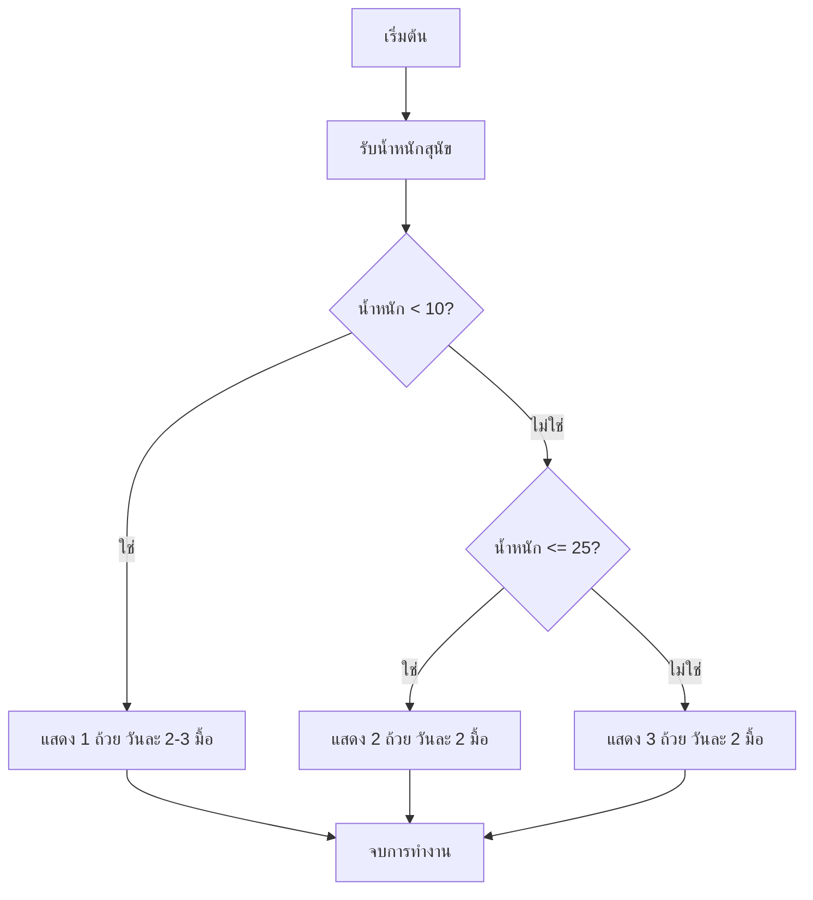
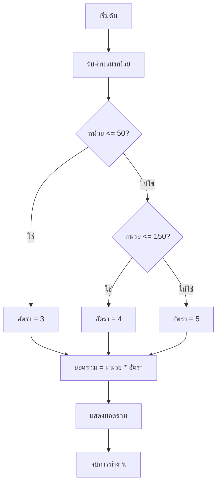

# รหัสเทียม (Pseudocode)

รหัสเทียมคือการเขียนขั้นตอนการทำงานเป็นข้อความสั้น ๆ ที่คนอ่านเข้าใจ ก่อนแปลงเป็นโค้ดจริง

## รหัสเทียมคืออะไร

รหัสเทียมอธิบายขั้นตอนด้วยข้อความ ส่วน [ผังงาน](./flowchart.md) แสดงขั้นตอนเดียวกันด้วยกล่องและลูกศร ทั้งสองแบบใช้วางแผนก่อนเขียนโค้ดจริง รหัสเทียมไม่มีไวยากรณ์ตายตัวเหมือนภาษาโปรแกรม จึงควรเลือกคำที่อ่านง่ายและใช้รูปแบบให้สม่ำเสมอมากกว่ากังวลว่าจะต้องใช้คำสั่งใดเป๊ะ ๆ

## คำสั่งพื้นฐาน

| คำสั่ง | ความหมาย |
| --- | --- |
| `START` / `END` | เริ่มต้น / จบการทำงาน |
| `READ` | รับข้อมูล |
| `PRINT` | แสดงผล |
| `SET x = ...` | กำหนดค่าให้ตัวแปร |
| `IF ... THEN` | ตรวจเงื่อนไขแรก |
| `ELSE IF` | ตรวจเงื่อนไขถัดไปเมื่อเงื่อนไขก่อนหน้าเป็นเท็จ |
| `ELSE` | ทำเมื่อไม่มีเงื่อนไขใดเป็นจริง |
| `ENDIF` | จบชุดเงื่อนไข |
| `WHILE ... ENDWHILE` | ทำขั้นตอนซ้ำตราบใดที่เงื่อนไขเป็นจริง |

การย่อหน้าช่วยบอกว่าขั้นตอนใดอยู่ภายใน `IF` ดังตัวอย่างสั้น ๆ นี้

```text
IF ฝนตก THEN
    PRINT "พกร่ม"
ENDIF
```

## จากผังงานเป็นรหัสเทียม

ผังงานและรหัสเทียมต่อไปนี้อธิบายการตรวจเลขคู่หรือเลขคี่แบบเดียวกัน



```text
START
READ number
IF number % 2 == 0 THEN
    PRINT "เลขคู่"
ELSE
    PRINT "เลขคี่"
ENDIF
END
```

## ตัวอย่าง: เลือกคำตอบจากช่วงค่า

โจทย์คือรับน้ำหนักสุนัขเป็นกิโลกรัม แล้วแสดงปริมาณอาหารที่เหมาะสม: น้อยกว่า 10 กก. ให้ 1 ถ้วย วันละ 2-3 มื้อ, 10-25 กก. ให้ 2 ถ้วย วันละ 2 มื้อ และมากกว่า 25 กก. ให้ 3 ถ้วย วันละ 2 มื้อ

```text
START
READ weight
IF weight < 10 THEN
    PRINT "1 ถ้วย วันละ 2-3 มื้อ"
ELSE IF weight <= 25 THEN
    PRINT "2 ถ้วย วันละ 2 มื้อ"
ELSE
    PRINT "3 ถ้วย วันละ 2 มื้อ"
ENDIF
END
```



การทดสอบที่สองจะทำงานเมื่อการทดสอบแรกเป็นเท็จเท่านั้น จึงไม่ต้องเขียน `AND weight >= 10` ซ้ำ

## จากรหัสเทียมเป็นโค้ด Python

| รหัสเทียม | Python |
| --- | --- |
| `READ` | `input()` |
| `SET` | `=` |
| `IF` / `ELSE IF` / `ELSE` | `if` / `elif` / `else` |
| `ENDIF` | ถอยระดับย่อหน้ากลับ |
| `WHILE` | `while` |
| `PRINT` | `print()` |

ยังไม่ต้องติดตั้งหรือรัน Python ตอนนี้ โค้ด Python ที่ได้จากตัวอย่างอาหารสุนัขจะหน้าตาแบบนี้ ซึ่งจะเรียนละเอียดในบทถัดไป

```python
weight = float(input("น้ำหนักสุนัข (กก.): "))

if weight < 10:
    print("1 ถ้วย วันละ 2-3 มื้อ")
elif weight <= 25:
    print("2 ถ้วย วันละ 2 มื้อ")
else:
    print("3 ถ้วย วันละ 2 มื้อ")
```

บท [พื้นฐาน](./basics.md), [การรับและแสดงผล](./input-output.md) และ [เงื่อนไข](./conditions.md) จะอธิบายส่วนต่าง ๆ ของโค้ดตัวอย่างนี้

## ข้อผิดพลาดที่พบบ่อย

- เขียนละเอียดจนกลายเป็นโค้ดจริง ทำให้เสียประโยชน์ของรหัสเทียม
- ข้ามกรณี `ELSE` จนบางข้อมูลไม่มีคำตอบ
- กำหนดช่วงค่าซ้อนทับกันหรือมีช่องโหว่ เช่น ลืมค่า 10 พอดี
- ไม่มี `ENDIF` หรือ `ENDWHILE` จนอ่านไม่ออกว่าเงื่อนไขหรือการทำซ้ำจบตรงไหน
- ลืม `START` หรือ `END`

## แบบฝึกหัด

1. เขียนรหัสเทียมที่รับคะแนนแบบทดสอบ 3 ครั้ง คำนวณค่าเฉลี่ย แล้วแสดง “ผ่าน” ถ้าค่าเฉลี่ยตั้งแต่ 60 ขึ้นไป มิฉะนั้นแสดง “ไม่ผ่าน”
2. เขียนรหัสเทียมที่รับค่าดัชนี UV แล้วแนะนำการป้องกันแดด: 0-2 แสดง “ไม่ต้องทา”, 3-7 แสดง “ทา SPF 30” และมากกว่า 7 แสดง “ทา SPF 50 และกางร่ม”
3. เขียนทั้งรหัสเทียมและผังงานคำนวณค่าไฟ: 0-50 หน่วยคิดหน่วยละ 3 บาท, 51-150 หน่วยคิดหน่วยละ 4 บาท และมากกว่า 150 หน่วยคิดหน่วยละ 5 บาท โดยรับจำนวนหน่วยแล้วแสดงยอดรวม เพื่อให้โจทย์นี้ไม่ซับซ้อน ให้คิดหน่วยทั้งหมดด้วยอัตราเดียวตามช่วงที่ใช้

<details class="answer-reveal">
<summary>ดูเฉลยแบบฝึกหัด</summary>

### เฉลยข้อ 1

หาผลรวมของคะแนนทั้งสามแล้วหารด้วย 3 ก่อนตรวจว่าเฉลี่ยถึง 60 หรือไม่

```text
START
READ score1, score2, score3
SET average = (score1 + score2 + score3) / 3
IF average >= 60 THEN
    PRINT "ผ่าน"
ELSE
    PRINT "ไม่ผ่าน"
ENDIF
END
```

### เฉลยข้อ 2

เรียงช่วงดัชนี UV จากค่าต่ำไปสูงเพื่อให้ทุกค่าถูกเลือกเพียงหนึ่งทาง

```text
START
READ uv
IF uv <= 2 THEN
    PRINT "ไม่ต้องทา"
ELSE IF uv <= 7 THEN
    PRINT "ทา SPF 30"
ELSE
    PRINT "ทา SPF 50 และกางร่ม"
ENDIF
END
```

### เฉลยข้อ 3

เลือกอัตราจากจำนวนหน่วยก่อน แล้วคูณหน่วยทั้งหมดด้วยอัตรานั้น

```text
START
READ units
IF units <= 50 THEN
    SET rate = 3
ELSE IF units <= 150 THEN
    SET rate = 4
ELSE
    SET rate = 5
ENDIF
SET total = units * rate
PRINT total
END
```



</details>

## Mini challenge

เขียนรหัสเทียมคำนวณราคาตั๋วหนัง โดยรับอายุลูกค้าและสถานะสมาชิก: อายุน้อยกว่า 12 ปี ราคา 80 บาท, อายุ 12-59 ปี ราคา 150 บาท, อายุ 60 ปีขึ้นไป ราคา 100 บาท และสมาชิกได้ลดอีก 20 บาท จากนั้นแสดงราคาสุดท้าย

<details class="answer-reveal">
<summary>ดูเฉลย Mini challenge</summary>

กำหนดราคาจากช่วงอายุก่อน แล้วค่อยลดราคาเมื่อเป็นสมาชิกเพื่อไม่ต้องเขียนส่วนลดซ้ำทุกช่วง

```text
START
READ age, is_member
IF age < 12 THEN
    SET price = 80
ELSE IF age < 60 THEN
    SET price = 150
ELSE
    SET price = 100
ENDIF
IF is_member == true THEN
    SET price = price - 20
ENDIF
PRINT price
END
```

```python
age = 25
is_member = True

if age < 12:
    price = 80
elif age < 60:
    price = 150
else:
    price = 100

if is_member:
    price = price - 20

print(price)
```

</details>

## สรุป

รหัสเทียมช่วยให้เราเน้นเหตุผลและลำดับขั้นโดยยังไม่ต้องกังวลเรื่องไวยากรณ์ เมื่อแผนชัดเจนแล้วจึงค่อยแปลงแต่ละคำสั่งเป็นโค้ดจริง
