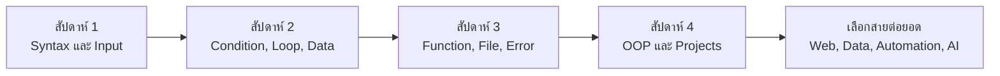

# Roadmap การเรียน Python101

แผนนี้ออกแบบสำหรับผู้เริ่มต้น ใช้เวลาประมาณ 4 สัปดาห์ หากมีเวลาน้อยให้ยืดเป็น 6-8 สัปดาห์ได้

## ภาพรวมเส้นทางเรียน

## สัปดาห์ที่ 1: เริ่มเขียนโค้ด

- ติดตั้ง Python และ editor
- รันไฟล์ `.py`
- เรียน variables, strings, numbers, booleans
- ฝึก `print()` และ `input()`

เป้าหมาย: เขียนโปรแกรมรับข้อมูลและแสดงผลได้

## สัปดาห์ที่ 2: ควบคุมการทำงาน

- เงื่อนไข `if/elif/else`
- loop `for` และ `while`
- list และ dictionary

เป้าหมาย: สร้างเกมทายเลขและโปรแกรมเก็บรายการง่าย ๆ ได้

## สัปดาห์ที่ 3: เขียนโค้ดให้เป็นระบบ

- functions
- files
- error handling
- modules

เป้าหมาย: สร้าง todo app ที่บันทึกไฟล์ได้และไม่พังง่ายเมื่อผู้ใช้กรอกผิด

## สัปดาห์ที่ 4: ต่อโปรเจกต์จริง

- OOP พื้นฐาน
- ทำโปรเจกต์ 2-3 ชิ้น
- อ่าน docs และค้น error เอง
- เริ่มเรียน virtual environment และ pip

เป้าหมาย: มี portfolio beginner project อย่างน้อย 2 ชิ้น

## หลังจบ Python101

เลือกทางต่อยอด:

- Web: Flask, FastAPI, Django
- Data: pandas, matplotlib, Jupyter
- Automation: pathlib, requests, scheduling
- AI: numpy, scikit-learn, PyTorch พื้นฐาน

## Checklist

- อธิบายตัวแปรและชนิดข้อมูลได้
- ใช้ condition และ loop ได้
- ใช้ list/dictionary ได้
- เขียน function ได้
- อ่านเขียนไฟล์ได้
- จัดการ error พื้นฐานได้
- ทำโปรเจกต์เล็ก ๆ ได้ด้วยตัวเอง
